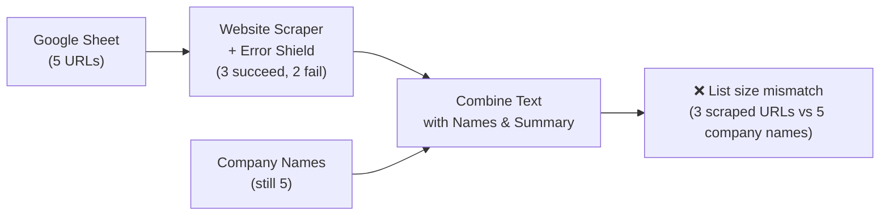
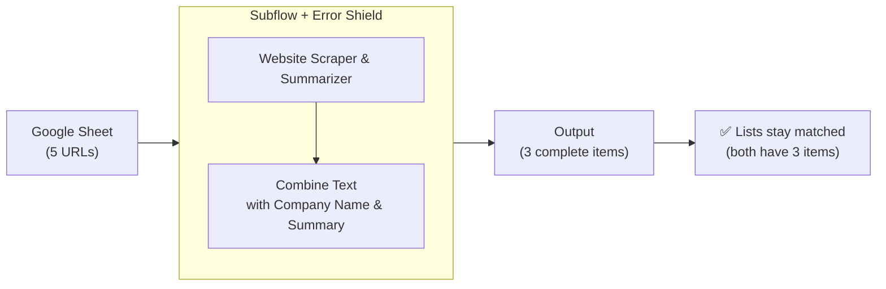

> ## Documentation Index
> Fetch the complete documentation index at: https://docs.gumloop.com/llms.txt
> Use this file to discover all available pages before exploring further.

# List Size Mismatch Errors

List size mismatch errors occur when you try to use lists of different lengths together in a node that's running in Loop Mode or expecting multiple list inputs. They're easy to understand and fix once you know what to look for! This guide will help you identify these errors and show you exactly how to resolve them.

## What is a List Size Mismatch Error?

A list size mismatch error happens when a node receives multiple list inputs of different lengths. In Gumloop, when a node processes multiple list inputs together (eg in Loop Mode), the lists must be the same size so the node knows how to pair up the items.

Let's look at a simple example using a `Combine Text` node:

* A list of 5 company names from a Google Sheet
* A list of 2 company URLs from an Airtable

The node won't know how to match up the remaining 3 companies, causing a list size mismatch error. Essentially, the Google Sheet list tells the node to loop 5 times while the Airtable list expects 2 iterations - this mismatch means inputs can't be properly paired.

## Why Do List Size Mismatches Occur?

Let's explore the two main scenarios where list size mismatches typically occur, using a real example workflow that processes company data. You can follow along with the [example workflow here](https://www.gumloop.com/pipeline?workbook_id=bALShPdR6PmV8816HHrJLW).

### 1. Direct Source vs Processed Data

This scenario occurs when:

* One input comes directly from a source (like a Google Sheet)
* Another input goes through processing that may filter or skip items
* The processed list ends up shorter than the source list

**Real-World Example: Company Data Processing**

In our [example workflow](https://www.gumloop.com/pipeline?workbook_id=bALShPdR6PmV8816HHrJLW), we're:

1. Reading company URLs from a Google Sheet
2. Filtering invalid URLs
3. Scraping and summarizing company information
4. Combining the original company name with its description

<div align="center">
  
</div>

> Note: One of the inputs is not a valid URL

When we run this workflow, we encounter a list size mismatch:

```text theme={"dark"}
Node 'Combine Text' running in Loop Mode has an input 'input2' which is a list of 4 items.
This is not matching the size of another one of the inputs, which has 5 items.
```

<div align="center">
  
</div>

This error occurs because:

* The company names come directly from the Google Sheet (5 items)
* The descriptions come from filtered and processed data (4 items, one was invalid)
* The `Combine Text` node can't match these different-sized lists

### 2. Error Shield Effects

A similar mismatch occurs with Error Shield:

* When Error Shield wraps around nodes processing list items
* Failed items are skipped, reducing the output list size
* Other inputs retain their original size

You can see this same issue in action in [this variation of our workflow](https://www.gumloop.com/pipeline?workbook_id=cAr7Ybw5JxmGjQJAb5vsqD\&run_id=fCcACCY6kf5Foj6g6cEZdG) where we use Error Shield around the website scraper instead of a filter.

## Using Subflows to Resolve List Size Mismatch Errors

The solution to these list size mismatches is proper workflow organization using subflows. Let's see how we can fix our example workflow.

[View the corrected workflow here](https://www.gumloop.com/pipeline?workbook_id=pzYEDhXYvkLxsRdPeDvKEF)

<div align="center">
  
</div>

Key improvements in the solution:

1. Related operations (scraping, summarizing, text combination) are grouped in a subflow
2. Error Shield wraps the entire subflow
3. Failed items are handled consistently throughout the process

This structure ensures that when an item fails:

* All related operations for that item are skipped
* List sizes stay matched throughout the workflow
* Error handling is consistent and predictable

## Error Shield Placement

The key to resolving list size mismatches is understanding how Subflows & Error Shield affects your data when it's placed in different locations. Let's see why Error Shield works better around a subflow than around individual nodes.

## The Problem: Error Shield Around Individual Nodes

Let's look at a typical workflow:



When Error Shield is around just the Website Scraper:

1. The scraper fails for 2 URLs
2. Error Shield removes those 2 items from the scraper's output
3. But the company names list hasn't been filtered
4. Result: List size mismatch (3 scraped URLs vs 5 company names)

Essentially, you've filtered out items in one branch of your workflow but not in others.

## The Solution: Error Shield Around Subflow

Here's the better approach:



When Error Shield wraps a subflow:

1. If the scraper fails for 2 URLs
2. Error Shield removes those items from ALL operations in the subflow
3. Both the scraped content AND company names are removed for failed items
4. Result: Lists stay matched (both have 3 items)

Think of it this way: When Error Shield is around a subflow, it keeps related data together. If anything fails for an item, all data for that item is removed consistently. This prevents mismatches that happen when some data is removed in one place but kept in another.

### Summary

Remember: If a node can fail for some items in a list, wrap its entire operation group (including any nodes that use related data) in a subflow with Error Shield.

Learn more about subflows here: [https://docs.gumloop.com/core-concepts/subflows](https://docs.gumloop.com/core-concepts/subflows)

**Still stuck?** If you've tried these solutions and still can't resolve your list size mismatch error, [reach out to us](https://portal.usepylon.com/gumloop/forms/help) and we'll help!
