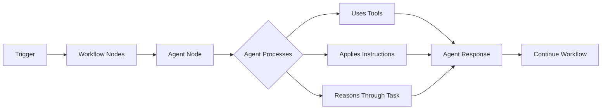
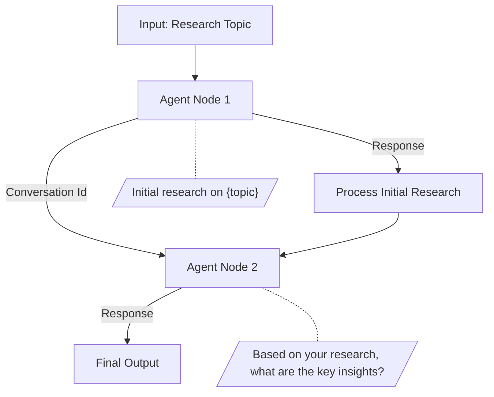

> ## Documentation Index
> Fetch the complete documentation index at: https://docs.gumloop.com/llms.txt
> Use this file to discover all available pages before exploring further.

# Agent Node

  <iframe src="https://player.vimeo.com/video/1148777926?h=fb7fe4ffbb" style={{ width: '100%', aspectRatio: '16/9' }} frameBorder="0" allow="autoplay; fullscreen; picture-in-picture" title="Agents as a Node" />

The Agent node lets you run any of your pre-configured agents directly within your workflows. This brings the intelligent, adaptive decision-making of agents into your structured automation pipelines, and unlocks powerful capabilities like scheduling agents, triggering them via webhooks, and responding to events automatically.

<Info>
  **New to Agents?** Agents are AI-powered assistants that use tools to solve open-ended tasks. Learn about creating and configuring agents in the [Agents documentation](/core-concepts/agents).
</Info>

## Why Use Agents in Workflows?

Placing agents inside workflows gives you the best of both worlds, and unlocks capabilities that standalone agents don't have:

| Capability                 | Standalone Agent | Agent in Workflow |
| -------------------------- | ---------------- | ----------------- |
| **Manual Chat**            | ✅ Yes            | ✅ Yes             |
| **Scheduled Runs**         | ❌ No             | ✅ Yes             |
| **Webhook Triggers**       | ❌ No             | ✅ Yes             |
| **Event-Based Triggers**   | ❌ No             | ✅ Yes             |
| **Chain with Other Nodes** | ❌ No             | ✅ Yes             |
| **Batch Processing**       | ❌ No             | ✅ Yes             |

**The key insight**: By embedding an agent in a workflow, your agent inherits all the triggering and automation capabilities that workflows provide.

<CardGroup cols={2}>
  <Card title="Schedule Your Agents" icon="clock">
    Run agents on a schedule: daily summaries, weekly reports, or any cadence you need.
  </Card>

  <Card title="Trigger via Webhook" icon="webhook">
    Call your agent from external systems using webhook triggers.
  </Card>

  <Card title="Respond to Events" icon="bolt">
    Trigger agents when events happen: new emails, form submissions, database updates.
  </Card>

  <Card title="Chain with Logic" icon="diagram-project">
    Combine agent intelligence with deterministic workflow logic for hybrid automation.
  </Card>
</CardGroup>

## How It Works

1. A trigger starts your workflow (schedule, webhook, event, or manual)
2. Your workflow passes data to the Agent node as a prompt
3. The agent processes the request using its configured tools, integrations, and instructions
4. The agent returns its response and any generated attachments
5. Your workflow continues with the agent's output

## Adding an Agent Node

  

1. Add an **Agent** node from the "Using AI" category
2. Select an agent from the dropdown (shows all agents you have access to)
3. Configure your prompt and optional settings

Once you select an agent, the node displays the agent's icon, name, and available tools:

  

<Tip>
  **Quick Edit**: Click the **Edit Agent** button in the node toolbar to jump directly into the agent builder and modify the agent's tools, instructions, or model.
</Tip>

  

## Node Inputs

| Input                        | Type     | Required | Description                                                                                   |
| ---------------------------- | -------- | -------- | --------------------------------------------------------------------------------------------- |
| **Agent**                    | Dropdown | Yes      | Select which agent to run                                                                     |
| **Prompt**                   | Text     | Yes      | The message to send to the agent                                                              |
| **Previous Conversation ID** | Text     | No       | Continue an existing conversation (see [Continuing Conversations](#continuing-conversations)) |

The **Prompt** input can be a static value or connected from another node's output, allowing you to pass dynamic data to your agent.

## Node Outputs

| Output               | Type | Description                                                    |
| -------------------- | ---- | -------------------------------------------------------------- |
| **Response**         | Text | The agent's final text response                                |
| **Messages**         | Text | Full conversation history as JSON (includes tool calls)        |
| **Attachment Names** | Text | Comma-separated file objects of generated files (e.g., images) |
| **Conversation Id**  | Text | ID for continuing this conversation in future runs             |

## Continuing Conversations

By default, each Agent node run starts a fresh conversation. To maintain context across multiple interactions (for example, to ask follow-up questions or build on previous responses) you can continue an existing conversation.

**To enable conversation continuity:**

1. Click **Show More Options** in the Agent node
2. Enable the **Continue Conversation?** toggle
3. Connect a `Conversation Id` output from a previous Agent node to the **Previous Conversation ID** input

  

**Example: Multi-Turn Research Workflow**

The second Agent node receives the `Conversation Id` from the first, allowing it to reference and build upon the initial research without needing to repeat context in the prompt.

<Note>
  **When to use conversation continuity**: Use this when you need the agent to remember what it said or did in a previous step. If each Agent node handles an independent task, you don't need to continue conversations.
</Note>

## Permissions & Access

When you run a workflow with an Agent node, two things must be in place for it to work:

1. **Agent Access**: The user running the workflow must have access to the agent
2. **Credential Access**: The user must have authenticated with any integrations the agent uses

### Agent Access

If a user tries to run a workflow but doesn't have access to the agent, the node will fail with an error. This commonly happens when you share a workflow (as an interface, template, or with collaborators) but forget to share the underlying agent.

**Ways to share an agent:**

| Method                           | How to Set Up                                                                        | Best For                                    |
| -------------------------------- | ------------------------------------------------------------------------------------ | ------------------------------------------- |
| **Share with specific users**    | Open agent → Share → Add users by email. Choose a role: Editor, Viewer, or Use Only. | Small teams, specific collaborators         |
| **Share with your organization** | Open agent → Share → Set General Access to "Organization"                            | Pro/Enterprise plans, company-wide agents   |
| **Share with anyone**            | Open agent → Share → Set General Access to "Anyone with link"                        | Public agents, templates for external users |

  

Agents support three sharing roles when adding individual users:

| Role         | What They Can Do                                                     |
| ------------ | -------------------------------------------------------------------- |
| **Editor**   | Full access to view, edit, configure, and manage the agent           |
| **Viewer**   | Can view the agent's configuration and chat with it, but cannot edit |
| **Use Only** | Can only chat with the agent. Cannot see any configuration details.  |

  

### Credential Access

Even if a user has access to the agent, they also need to have authenticated with any integrations the agent uses. For example, if your agent uses Gmail and Google Drive, users running the workflow must have their own Gmail and Google Drive credentials set up in Gumloop.

If credentials are missing, the agent won't be able to make tool calls for those integrations, and the task may fail or produce incomplete results.

<Warning>
  **Important**: The agent runs using the credentials of the user running the workflow, not the agent creator's credentials. Each user needs their own authenticated credentials for the integrations the agent uses.
</Warning>

### Setting Up Users with the Setup Link

To make it easy for others to authenticate with the required integrations, you can share an **agent setup link**. This link guides users through connecting the necessary credentials.

**To find the setup link:**

1. Open your agent
2. Click the **Share** button
3. Click **Copy setup link** from the share settings

Share this link with anyone who needs to run workflows using your agent. They'll be guided to authenticate with the required integrations before using the agent.

## Credit Costs

The Agent node has a base cost of 3 credits per run, charged on top of the actual credit cost of running the agent. For example, if an agent's total credit cost is 10 credits, you'd be charged 13 credits total on the workflow. This is similar to how custom nodes and MCP nodes also have a 3 credit base cost.

Beyond the base cost, credits are based on the AI model, message length, conversation history, and any tools or workflows the agent calls. For detailed pricing information, see [Understanding Credit Costs](/core-concepts/agents#understanding-credit-costs) in the Agents documentation.

## Loop Mode Support

The Agent node supports **Loop Mode** for batch processing multiple prompts:

1. Enable Loop Mode on the Agent node
2. Connect a list of prompts as input
3. Each item is sent as a separate message to the agent

<Info>
  Each loop iteration starts a **new conversation** unless you explicitly manage conversation IDs. For multi-turn conversations within a loop, you'll need to track and pass conversation IDs between iterations.
</Info>

## Use Cases

<AccordionGroup>
  <Accordion title="Scheduled Agent Reports">
    Run agents on a schedule to generate daily summaries, weekly reports, or periodic analyses without manual intervention.

    **Example**: Every Monday at 9am → Agent analyzes last week's sales data → Sends summary to Slack
  </Accordion>

  <Accordion title="Webhook-Triggered Agent Actions">
    Trigger agents from external systems via webhooks. Connect your agent to any system that can make HTTP requests.

    **Example**: CRM sends webhook when deal closes → Agent generates personalized onboarding plan → Saves to Notion
  </Accordion>

  <Accordion title="Event-Driven Agent Responses">
    Use trigger nodes to run agents when events happen: new emails, form submissions, database changes.

    **Example**: New support email arrives → Agent analyzes urgency and sentiment → Routes to appropriate team
  </Accordion>

  <Accordion title="Hybrid Decision Workflows">
    Combine deterministic workflow logic with intelligent agent decisions where human-like judgment is needed.

    **Example**: Lead data → Workflow enriches → Agent evaluates fit → Workflow routes to sales or nurture
  </Accordion>

  <Accordion title="Batch Processing with Agents">
    Process lists of items through an agent using Loop Mode. Research multiple companies, analyze multiple documents, or handle multiple requests in batch.

    **Example**: List of 50 companies → Agent researches each → Compiled report output
  </Accordion>
</AccordionGroup>

## Best Practices

<CardGroup cols={2}>
  <Card title="Choose the Right Agent" icon="bullseye">
    Select agents configured for your specific use case. Ensure the agent has the necessary tools and integrations for the task.
  </Card>

  <Card title="Write Clear Prompts" icon="pencil">
    Be specific about what you want the agent to do. Include relevant context and use template variables to pass dynamic data.
  </Card>

  <Card title="Handle Outputs Appropriately" icon="code">
    Parse the **Messages** output if you need detailed conversation data. Check **Attachment Names** when expecting generated files.
  </Card>

  <Card title="Start with Simple Triggers" icon="play">
    Test your agent workflow manually first, then add scheduling or event triggers once you've verified the agent behaves correctly.
  </Card>
</CardGroup>

## Troubleshooting

<AccordionGroup>
  <Accordion title="Agent Not Found">
    **Cause**: The selected agent was deleted or you lost access to it.

    **Solution**: Verify the agent exists in your [Agents page](https://www.gumloop.com/agents) and that you have permission to access it.
  </Accordion>

  <Accordion title="Permission Denied">
    **Cause**: You don't have sufficient access to the agent.

    **Solution**: Ask the agent owner to share the agent with you. They can add you by email from the Share dialog and assign you an appropriate role (Editor, Viewer, or Use Only). See [Permissions & Access](#permissions--access) for details.
  </Accordion>

  <Accordion title="Conversation Not Found">
    **Cause**: The conversation ID is invalid or you don't have access to it.

    **Solution**: Verify the conversation ID is correct and from a conversation you initiated. Make sure you're connecting the `Conversation Id` output from the correct previous Agent node.
  </Accordion>

  <Accordion title="Missing Credentials">
    **Cause**: The agent needs integrations you haven't authenticated.

    **Solution**: Visit your [Connectors page](https://www.gumloop.com/personal/connectors) and authenticate with the required services. If you received a setup link from the workflow creator, use that to set up all required credentials.
  </Accordion>

  <Accordion title="Agent Tool Calls Failing">
    **Cause**: You have access to the agent but haven't authenticated with the integrations it uses.

    **Solution**: Check which integrations the agent uses (Gmail, Google Drive, Slack, etc.) and ensure you have credentials set up for each one. Ask the workflow creator for the agent setup link if needed.
  </Accordion>
</AccordionGroup>

## Related Resources

<CardGroup cols={3}>
  <Card title="Agents" icon="robot" href="/core-concepts/agents">
    Learn how to create and configure agents
  </Card>

  <Card title="Agents in Slack" icon="slack" href="/core-concepts/agents_slack">
    Deploy agents to Slack channels
  </Card>

  <Card title="Workflow Triggers" icon="bolt" href="/core-concepts/workflow_triggers">
    Learn about workflow triggers
  </Card>
</CardGroup>
