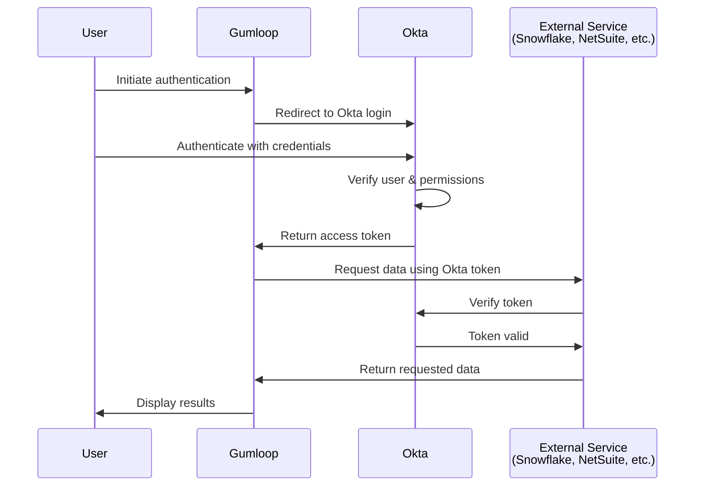

> ## Documentation Index
> Fetch the complete documentation index at: https://docs.gumloop.com/llms.txt
> Use this file to discover all available pages before exploring further.

# Okta Integration

This guide is for **organization administrators** who want to configure Okta as the authentication provider for Gumloop. By following these steps, you'll register Gumloop as an application in your Okta environment, enabling your organization members to authenticate with Gumloop-connected services (like Snowflake and NetSuite) using your existing Okta identity infrastructure.

<Note>
  **Intended Audience:** Okta administrators and Gumloop organization administrators. This setup is performed once at the organization level and enables Okta authentication for all organization members.
</Note>

## What This Guide Covers

This documentation walks through two main configuration areas:

1. **Okta Configuration** - Register Gumloop as an OAuth application in your Okta Admin Console
2. **Gumloop Configuration** - Add the Okta OAuth credentials to your organization at [gumloop.com/settings/organization/oauth-configuration](https://www.gumloop.com/settings/organization/oauth-configuration)

Once complete, your organization members will authenticate through Okta instead of managing individual service credentials.

## Overview

Okta integration enables enterprise organizations to leverage their existing identity management infrastructure for Gumloop authentication. Instead of managing separate credentials for each service, users authenticate through Okta, which acts as the central authorization server.

<Note>
  **How it works:** This integration connects Gumloop to your Okta environment, allowing Gumloop to use Okta as an authentication provider. For this to work, your external services (Snowflake, NetSuite, Databricks, etc.) must already be configured to accept Okta as an OAuth provider. Gumloop then uses your Okta credentials to authenticate with these Okta-enabled services.
</Note>

<Tip>
  **Currently supported services:** Any service that supports Okta External OAuth, including Snowflake, NetSuite, Databricks, etc.
</Tip>

### Why Use Okta with Gumloop?

<CardGroup cols={2}>
  <Card title="Centralized Authentication" icon="shield-check">
    Single sign-on experience across all Gumloop-connected services
  </Card>

  <Card title="Enhanced Security" icon="lock">
    Leverage your organization's existing security policies and MFA
  </Card>

  <Card title="Simplified Management" icon="users-gear">
    Manage access and permissions from one central location
  </Card>

  <Card title="Compliance Ready" icon="file-certificate">
    Meet enterprise security and compliance requirements
  </Card>
</CardGroup>

***

## How It Works

When Okta is configured for Gumloop, authentication follows this flow:



<Note>
  Okta acts as the intermediary between Gumloop and external services. Instead of Gumloop directly authenticating with services like Snowflake, it uses the access token from Okta to verify the user's identity and permissions.
</Note>

***

## Prerequisites

Before configuring Okta for Gumloop, ensure you have:

<Steps>
  <Step title="Okta Admin Access">
    You must have administrator privileges in your Okta organization to create applications and authorization servers.
  </Step>

  <Step title="External Services Pre-Configured with Okta">
    **Critical:** Each service you want to use with Gumloop (e.g., Snowflake, NetSuite, Databricks) must already be configured to use Okta as an External OAuth provider. This is a separate configuration done within each service's settings, not in Gumloop.

    <Warning>
      **Important:** The Okta integration in Gumloop acts as a connection layer between Gumloop and your Okta-enabled services. It does NOT automatically enable OAuth for services. Each service must be independently configured to trust Okta for authentication before you can use it through Gumloop.

      For example:

      * **Snowflake:** Must be configured with Okta External OAuth in Snowflake settings
      * **NetSuite:** Must have Okta OAuth integration enabled in NetSuite
      * **Other services:** Check each service's documentation for "Okta OAuth" or "External OAuth" configuration
    </Warning>

    Without this prerequisite, authentication will fail even if Gumloop and Okta are properly connected.
  </Step>

  <Step title="Gumloop Organization">
    Your organization must be on an Enterprise plan and you must be an organization admin so you can access the [OAuth Configuration page](https://www.gumloop.com/settings/organization/oauth-configuration).
  </Step>
</Steps>

***

## Configuration Procedure

The setup process involves three main stages: creating the Gumloop OAuth client, configuring an authorization server, and collecting the necessary information.

<Warning>
  **Important:** The steps below are representative examples for configuring Okta for External OAuth. You can configure Okta to any desired state and use any desired OAuth flow, provided you can obtain the necessary information for Gumloop's OAuth Configuration page.

  Always consult your internal security policies when configuring an authorization server to ensure your organization meets all necessary regulations and compliance requirements.
</Warning>

### Step 1: Create an OAuth Client for Gumloop

First, you'll create an OAuth-compatible client application in Okta that represents Gumloop.

<Steps>
  <Step title="Navigate to Applications">
    1. Log in to the **Okta Admin Console**
    2. Click **Applications** in the left sidebar
    3. Click **Create App Integration**
  </Step>

  <Step title="Select Application Type">
    1. For **Sign-in method**, select **OIDC - OpenID Connect**
    2. For **Application type**, select **Web Application**
    3. Click **Next**
  </Step>

  <Step title="Configure Application Settings">
    Enter the following details:

    * **App integration name:** `Gumloop`
    * **App logo:** (Optional) Upload the Gumloop logo using [this link](https://canada1.discourse-cdn.com/flex027/uploads/gumloop/original/1X/d02ff8efcde6ac5d3ac8aa0376137d5f804da549.png)
    * **Sign-in redirect URIs:** `https://api.gumloop.com/auth/callback`
    * **Sign-out redirect URIs:** (Leave blank)
    * **Controlled access:** Choose based on your organization's needs (typically "Allow everyone in your organization to access")

    Click **Save**

    <Tip>
      Adding the [Gumloop logo](https://canada1.discourse-cdn.com/flex027/uploads/gumloop/original/1X/d02ff8efcde6ac5d3ac8aa0376137d5f804da549.png) helps your users easily identify the application in their Okta dashboard and during authentication flows.
    </Tip>

    <Note>
      You'll configure the grant types in the next step after the application is created.
    </Note>
  </Step>

  <Step title="Configure Grant Types">
    After saving, scroll to the **Grant type** section and click **Edit**:

    1. Under **Client acting on behalf of itself**, check:
       * **Client Credentials**
    2. Under **Core grants**, ensure the following are checked:
       * **Authorization Code**
       * **Refresh Token**
    3. Click **Save**

    <Info>
      Client Credentials grant type enables the application to authenticate on its own behalf, which is required for Gumloop's OAuth flow.
    </Info>
  </Step>

  <Step title="Save Client Credentials">
    After configuring grant types, scroll down to the **Client Credentials** section. You'll see:

    * **Client ID** - Save this value (you'll need it as `<OAUTH_CLIENT_ID>`)
    * **Client secret** - Click **Show secret** to reveal, then save this value (you'll need it as `<OAUTH_CLIENT_SECRET>`)

    <Warning>
      Keep these credentials secure. You'll need them when configuring Gumloop's OAuth Configuration page. The client secret is only shown once, so make sure to copy it now.
    </Warning>
  </Step>
</Steps>

### Step 2: Create an Authorization Server

Next, set up an authorization server that will handle authentication requests for Gumloop.

<Steps>
  <Step title="Access Authorization Servers">
    1. In the **Okta Admin Console**, navigate to **Security** > **API**
    2. Click the **Authorization Servers** tab
    3. Click **Add Authorization Server**
  </Step>

  <Step title="Configure Server Details">
    Enter the following information:

    * **Name:** `Gumloop Authorization Server` (or your preferred name)
    * **Audience:** Your service URL (e.g., `https://abc12345.snowflakecomputing.com` for Snowflake)
    * **Description:** Optional description for documentation purposes

    Click **Save**
  </Step>

  <Step title="Save the Authorization Server ID">
    After creating the authorization server, you'll see an **Issuer** URL with a format like:

    ```text theme={"dark"}
    https://your-domain.okta.com/oauth2/aus8x7abc123def
    ```

    The **Authorization Server ID** is the part after `/oauth2/` (in this example: `aus8x7abc123def`). Save this value as `<AUTHORIZATION_SERVER_ID>` - you'll need it for Gumloop configuration.
  </Step>
</Steps>

### Step 3: Configure Scopes

Scopes define what permissions and data the Gumloop application can access.

<Steps>
  <Step title="Add Base Scopes">
    1. In your authorization server, click the **Scopes** tab
    2. Click **Add Scope** for each of the following:

    | Scope Name       | Display Name   | Description                                 |
    | ---------------- | -------------- | ------------------------------------------- |
    | `openid`         | OpenID         | Required for OpenID Connect authentication  |
    | `profile`        | Profile        | Access to user profile information          |
    | `email`          | Email          | Access to user email address                |
    | `offline_access` | Offline Access | Enables refresh tokens for long-term access |

    <Tip>
      These are the minimum required scopes for Gumloop. Mark each as a **Default scope** so they're automatically included in authentication requests.
    </Tip>
  </Step>

  <Step title="Add Service-Specific Scopes">
    In addition to the base scopes, you must add service-specific scopes for each external service you want to use with Gumloop. These scopes define what roles and permissions users can access within each service.

    <Warning>
      **Important:** Without service-specific scopes, users will be able to authenticate but most operations will fail due to insufficient permissions. Each service requires its own set of scopes.
    </Warning>

    ### Common Service Scope Examples:

    **Snowflake:**

    * Create scopes for each role users need access to
    * **Format:** `session:role:ROLE_NAME` (role names must be uppercase unless created with quotes in Snowflake)
    * **Examples:**
      * `session:role:PUBLIC` - Basic read access
      * `session:role:ANALYST` - Analyst role
      * `session:role:DATA_ENGINEER` - Data engineer role
      * `session:role-any` - Allows switching between available roles (advanced)

    **NetSuite:**

    * Add NetSuite-specific role scopes as required by your NetSuite configuration
    * Consult your NetSuite OAuth documentation for required scope formats

    **Other Services:**

    * Refer to each service's External OAuth documentation for required scope formats
    * Most services use role-based scopes similar to Snowflake

    <Info>
      When creating each scope in Okta:

      1. Click **Add Scope**
      2. **Scope name:** Enter the exact scope (e.g., `session:role:ANALYST`)
      3. **Display name:** Enter a user-friendly name (e.g., "Snowflake Analyst Role")
      4. **Description:** Add a description for documentation
      5. Optionally mark as **Default scope** if all users should have this role
    </Info>

    <Tip>
      You can add more scopes later as your organization's needs grow. Start with the essential roles your users need for their workflows.
    </Tip>
  </Step>
</Steps>

### Step 4: Create Access Policy and Rules

Access policies control who can obtain tokens and under what conditions.

<Steps>
  <Step title="Create an Access Policy">
    1. In your authorization server, click the **Access Policies** tab
    2. Click **Add Policy**
    3. Enter the following:
       * **Name:** `Gumloop Access Policy`
       * **Description:**  description
       * **Assign to:** Select the Gumloop client application you created earlier
    4. Click **Create Policy**
  </Step>

  <Step title="Add a Rule to the Policy">
    1. In the newly created policy, click **Add Rule**
    2. Configure the rule:
       * **Rule name:** `Standard Access Rule`
       * **Grant type:** Select the following:
         * Authorization Code
         * Resource Owner Password
         * Client Credentials
         * Refresh Token
       * **User is:** Select based on your organization's needs (typically "Any user assigned the app")
       * **Scopes requested:** Select "The following scopes:" and choose:
         * `openid`
         * `profile`
         * `email`
         * `offline_access`
         * Any service-specific scopes you created
       * **Token lifetime:** Configure according to your security policies (defaults are typically sufficient)
    3. Click **Create Rule**
  </Step>
</Steps>

### Step 5: Collect Required Information

Now gather all the information you'll need to configure Gumloop.

<Steps>
  <Step title="Verify Your Collected Information">
    Ensure you have all of the following values before proceeding to configure Gumloop:

    | Information Needed          | Where to Find It                                          | Your Value                  |
    | --------------------------- | --------------------------------------------------------- | --------------------------- |
    | **Okta Domain**             | Your Okta URL (e.g., `company.okta.com`)                  | `<OKTA_DOMAIN>`             |
    | **Authorization Server ID** | From Step 2 - the part after `/oauth2/` in the Issuer URL | `<AUTHORIZATION_SERVER_ID>` |
    | **Client ID**               | From Step 1 - in the Client Credentials section           | `<OAUTH_CLIENT_ID>`         |
    | **Client Secret**           | From Step 1 - in the Client Credentials section           | `<OAUTH_CLIENT_SECRET>`     |

    <Note>
      These four values are all you need to configure Okta authentication in Gumloop. Make sure you have them ready before proceeding to the next section.
    </Note>
  </Step>
</Steps>

***

## Configuring Gumloop OAuth Configuration

After completing the Okta setup, you'll need to add these credentials to Gumloop so your organization members can use Okta authentication.

<Tip>
  This step must be completed by a **Gumloop organization administrator**. Regular users cannot configure OAuth settings for the organization.
</Tip>

<Steps>
  <Step title="Navigate to OAuth Configuration">
    Go to [gumloop.com/settings/organization/oauth-configuration](https://gumloop.com/settings/organization/oauth-configuration)
  </Step>

  <Step title="Add Okta OAuth Configuration">
    1. Click **Add Credential**
    2. Search **Okta OAuth**
    3. Choose **Okta** as the authentication type

    <div align="center">
      
    </div>
  </Step>

  <Step title="Enter Okta Details">
    Fill in the form with the four values you collected:

    * **Okta Domain:** `<OKTA_DOMAIN>` (e.g., `company.okta.com`)
    * **Authorization Server ID:** `<AUTHORIZATION_SERVER_ID>` (e.g., `aus8x7abc123def`)
    * **Client ID:** `<OAUTH_CLIENT_ID>`
    * **Client Secret:** `<OAUTH_CLIENT_SECRET>`

    Click **Save**

    <div align="center">
      
    </div>
  </Step>
</Steps>

***

## User Authentication Flow

Once Okta is configured, here's what the authentication experience looks like for your organization members:

<Tabs>
  <Tab title="For Organization Members" icon="users">
    ### Standard Authentication Experience

    When a user needs to authenticate with a service that uses Okta:

    1. Navigate to their [Connectors page](https://www.gumloop.com/personal/connectors)
    2. Find the service (e.g., Snowflake)
    3. Click the **Authenticate** button
    4. Get redirected to your organization's Okta login page
    5. Enter their Okta credentials
    6. Approve the requested permissions (first time only)
    7. Get redirected back to Gumloop - authentication complete!

    <Tip>
      Users don't need to configure anything - they simply authenticate through Okta using their existing credentials. The organization's OAuth configuration is automatically used.
    </Tip>

    **Step 1**:

    <div align="center">
      
    </div>

    **Step 2**:

    <div align="center">
      
    </div>
  </Tab>

  <Tab title="What Users See" icon="eye">
    ### Authentication Options

    On the Connectors page, users will see two authentication options:

    1. **OAuth/SSO Button** (Enabled) - This uses the organization's Okta configuration
    2. **Service Account Credentials** (Disabled) - This option is not available when organization OAuth is configured

    The OAuth/SSO option is the primary authentication method, ensuring all users authenticate through your organization's Okta infrastructure.
  </Tab>
</Tabs>

***

## Testing Your Configuration

Before rolling out Okta authentication to your entire organization, verify the setup works correctly.

<Steps>
  <Step title="Test User Authentication">
    1. Have a test user navigate to their [Connectors page](https://www.gumloop.com/personal/connectors)
    2. Click the authentication button for a configured service
    3. Verify they're redirected to Okta
    4. Complete the authentication flow
    5. Confirm successful authentication in Gumloop
  </Step>

  <Step title="Test Workflow Execution">
    1. Create a simple workflow using the Okta-authenticated service
    2. Run the workflow
    3. Verify it executes successfully using Okta credentials
    4. Check that data is retrieved correctly
  </Step>
</Steps>

***

## Advanced Configuration

### Using ANY Role with External OAuth

Some services (like Snowflake) support a special `session:role-any` scope that allows users to switch roles after authentication rather than being locked to a specific role.

<Steps>
  <Step title="Add ANY Role Scope">
    In your authorization server, create a scope named `session:role-any` with:

    * **Display name:** `Any Role`
    * **Description:** `Allows switching between available roles after authentication`
  </Step>

  <Step title="Configure Policy">
    Update your access policy rule to include the `session:role-any` scope in the list of allowed scopes.
  </Step>

  <Step title="User Experience">
    Users who authenticate with this scope can switch between their assigned roles within workflows, providing flexibility for workflows that require different permission levels.
  </Step>
</Steps>

### Multiple Authorization Servers

For complex organizations, you may want separate authorization servers for different environments or services:

<Tabs>
  <Tab title="By Environment">
    **Development vs Production**

    Create separate authorization servers:

    * `Gumloop Development` - For testing and development workflows
    * `Gumloop Production` - For production workflows

    Benefits:

    * Separate token lifetimes and policies
    * Isolated audit trails
    * Different scopes for each environment
  </Tab>

  <Tab title="By Service">
    **Service-Specific Servers**

    Create authorization servers per integration:

    * `Gumloop - Snowflake` - For Snowflake workflows
    * `Gumloop - NetSuite` - For NetSuite workflows

    Benefits:

    * Service-specific policies and scopes
    * Granular access control
    * Easier compliance auditing
  </Tab>
</Tabs>

***

## Related Documentation

<CardGroup cols={3}>
  <Card title="Credentials" icon="key" href="/core-concepts/credentials">
    Learn about personal, team, and organization credentials
  </Card>

  <Card title="AI Model Governance" icon="shield" href="/enterprise-features/ai_model_control">
    Configure organization-wide AI model access and routing
  </Card>

  <Card title="Custom Roles" icon="user-tag" href="/enterprise-features/user_groups">
    Manage organizational roles and permissions
  </Card>
</CardGroup>

***

## Need Help?

If you encounter issues during setup or have questions about Okta integration:

* **Email:** [support@gumloop.com](mailto:support@gumloop.com)
* **Okta Support:** For Okta-specific configuration questions, consult [Okta's documentation](https://developer.okta.com/docs/)
