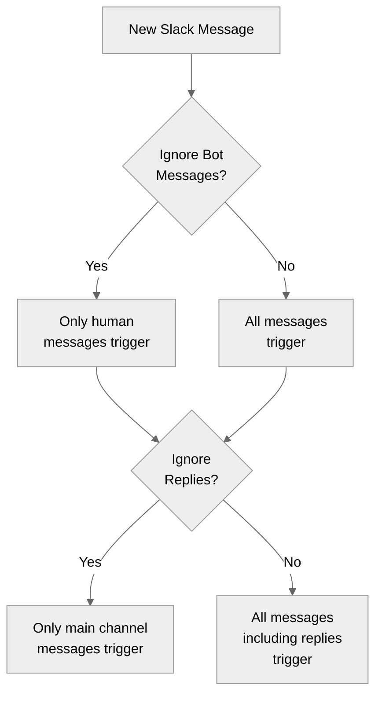

> ## Documentation Index
> Fetch the complete documentation index at: https://docs.gumloop.com/llms.txt
> Use this file to discover all available pages before exploring further.

# Workflow Triggers

> Automatically start your workflows based on schedules, webhooks, and external events.

A trigger automatically starts your Gumloop workflow based on external events. For example, your workflow can start whenever:

* A specific time arrives (like 9 AM every day)
* A new email lands in your Gmail
* Someone submits your Typeform
* A new record is added to your Airtable
* A new issue is created in Linear or Jira
* An item changes on your Monday.com board
* Someone reacts to a message in your Slack channel
* Relevant changes are detected on the web for a topic you're tracking

<div align="center">
  
</div>

## Types of Triggers

<CardGroup cols={2}>
  <Card title="Time Based" icon="clock">
    Schedule workflows to run at specific times with daily, weekly, or custom schedules. Perfect for automating regular tasks.
  </Card>

  <Card title="Webhooks" icon="webhook">
    Start your workflows from external applications. Useful for connecting Gumloop with your other tools.
  </Card>

  <Card title="Email & Messaging" icon="envelope">
    Trigger workflows from Gmail messages, Slack messages, Slack reactions, Microsoft Teams channels, or other communication platforms.
  </Card>

  <Card title="Database & Forms" icon="database">
    Automatically respond to changes in Airtable, Notion, Google Sheets, or form submissions.
  </Card>
</CardGroup>

***

## Time Based Triggers

The time trigger is available under the 'Triggers' category in the Node Library. You can configure the time settings by specifying how frequently the workflow should run or by customizing the settings manually using the settings cog.

### Manual Time Settings

<AccordionGroup>
  <Accordion title="Time Configuration Parameters">
    * **Minute**: The exact minute within the hour (e.g., `0` for the start of the hour)
    * **Hour**: The specific hour of the day (e.g., `6` for 6:00 AM)
    * **Day of Month**: The specific day(s) of the month (use `*` for all days)
    * **Month**: The specific month(s) (use `*` for all months)
    * **Day of Week**: The day of the week (`0` and `7` = Sunday, `1` = Monday, etc.)
    * **Timezone**: The time zone for the schedule
    * **Max Failure Count**: The number of retry attempts if a trigger fails
  </Accordion>
</AccordionGroup>

<Info>
  **Example Configuration**: The workflow is configured to run **every Monday at 6:00 AM Pacific Time**, with up to 3 retry attempts if it fails.
</Info>

<div align="center">
  
</div>

***

## Webhooks

You can add the webhook trigger by clicking on the webhook icon on the top bar:

<div align="center">
  
</div>

Check out our [API Reference guide](https://docs.gumloop.com/api-reference/authentication) for more details on how to start workflows via webhook and how to get the output.

<div align="center">
  
</div>

***

## Triggers as Nodes

Drop these nodes directly into your workflow and toggle the "Activate as workflow trigger" option to trigger your automation:

### Gmail

Starts your workflow when you receive new emails. It can be set to a specific label or your entire inbox.

<Warning>
  Due to Google watch response API limitations, only one Gmail account can be monitored per credential. For multiple accounts, consider using scheduled time triggers instead. [More info here](https://docs.gumloop.com/nodes/integrations/gmail_reader#important-limitations%3A-multiple-gmail-accounts-%26-email-filtering)
</Warning>

<div align="center">
  
</div>

***

### Slack

Starts your workflow when you receive a new message in the specified channel. Can work on both new messages and thread replies.

<div align="center">
  
</div>

#### Filtering Options

When using the Slack Message Reader as a trigger, two important filtering options help you control exactly which messages will start your workflow:

<Tabs>
  <Tab title="Ignore Bot Messages">
    This toggle controls whether automated messages should trigger your workflow.

    * **No (Default)**: All messages will trigger your workflow, including those from bots and integrations
    * **Yes (Recommended)**: Only human-generated messages will trigger your workflow
      * Prevents potential trigger loops where your workflow output triggers itself
      * Reduces noise from system notifications and other automated messages
      * Essential when your workflow posts back to the same channel
  </Tab>

  <Tab title="Ignore Replies">
    This toggle determines whether thread replies should trigger your workflow.

    * **No (Default)**: All messages trigger your workflow, including replies in threads
      * Best for monitoring ongoing conversations
      * Useful for support bots that need to track entire discussions

    * **Yes**: Only new standalone messages will trigger your workflow
      * Replies within conversation threads are ignored
      * Focuses automation on new topics/conversations only
      * Reduces the volume of triggers in active channels
  </Tab>
</Tabs>

#### Recommended Trigger Settings

For most automations, we recommend:

* **Ignore Bot Messages: Yes** - Prevents trigger loops and focuses on human communications
* **Ignore Replies: No** - Captures all relevant communications including thread discussions



<Tip>
  When building response bots, always enable "Ignore Bot Messages" to prevent infinite loops where your bot responds to its own messages.
</Tip>

***

### Slack Reaction Reader

Starts your workflow when someone reacts to a message with an emoji in the specified Slack channel. This is a real-time trigger that fires within seconds of the reaction being added.

<div align="center">
  
</div>

#### Configuration

<Steps>
  <Step title="Add the Node">
    Add the **Slack Reaction Reader** node to your workflow.
  </Step>

  <Step title="Select Channel">
    Choose the Slack channel to watch for reactions.
  </Step>

  <Step title="Filter by Emoji (Optional)">
    Select one or more specific emoji to listen for (e.g., `white_check_mark`, `thumbsup`). Leave empty to trigger on any reaction. Custom workspace emoji are supported.
  </Step>

  <Step title="Activate Trigger">
    Toggle `Activate as flow trigger` to Yes.
  </Step>

  <Step title="Save Workflow">
    Save your workflow.
  </Step>
</Steps>

#### Filtering Options

<Tabs>
  <Tab title="Ignore Reactions From Bots">
    Controls whether reactions added by bots should trigger your workflow.

    * **Yes (Default)**: Only reactions from human users will trigger your workflow. Reactions from Gumloop itself are always ignored regardless of this setting.
    * **No**: All reactions trigger your workflow, including those from bots and integrations.
  </Tab>

  <Tab title="Include Reactions On Thread Replies">
    Controls whether reactions on messages inside threads should trigger your workflow.

    * **Yes (Default)**: Reactions on both top-level channel messages and thread replies will trigger your workflow.
    * **No**: Only reactions on top-level channel messages will trigger your workflow. Reactions inside threads are ignored.
  </Tab>

  <Tab title="Read Full Thread">
    Controls how much message context is included in the output when a reaction fires the trigger.

    * **No (Default)**: Only the single message that was reacted to is returned.
    * **Yes**: The entire thread containing the reacted message is fetched and returned as the Message output.
  </Tab>
</Tabs>

<Info>
  **Output Data**: When used as a trigger, the node outputs single values for each field: Message, Emoji, Reaction Count, Reacted By, Message Sender, Attachment Names, Thread ID, Thread Link, Channel Name, Channel ID, and Date.
</Info>

<AccordionGroup>
  <Accordion title="Use Cases">
    * Approve requests by reacting with a checkmark emoji
    * Escalate messages that receive a specific emoji (e.g., 🚨) to another channel or system
    * Log reacted messages to a spreadsheet or database for tracking
    * Kick off follow-up workflows when a team lead reacts to a message
    * Build a bookmarking system where reacting saves messages to Notion or Airtable
  </Accordion>
</AccordionGroup>

***

### Microsoft Teams

Starts your flow when a new message is posted in a specified Microsoft Teams channel. Works with both new messages and thread replies.

<Warning>
  Teams triggers only work with Microsoft 365 work or school accounts. Personal Microsoft accounts are not supported.
</Warning>

<div align="center">
  
</div>

#### Filtering Options

When using the Teams Message Reader as a trigger, two filtering options help you control which messages start your flow:

<Tabs>
  <Tab title="Ignore Bot Messages">
    This toggle controls whether automated messages should trigger your flow.

    * **No (Default)**: All messages will trigger your flow, including those from bots and applications
    * **Yes (Recommended)**: Only human-generated messages will trigger your flow
      * Prevents potential trigger loops where your flow output triggers itself
      * Reduces noise from system notifications and other automated messages
      * Essential when your flow posts back to the same channel
  </Tab>

  <Tab title="Ignore Replies">
    This toggle determines whether thread replies should trigger your flow.

    * **No (Default)**: All messages trigger your flow, including replies in threads
      * Best for monitoring ongoing conversations
      * Useful for support bots that need to track entire discussions

    * **Yes**: Only new standalone messages will trigger your flow
      * Replies within conversation threads are ignored
      * Focuses automation on new topics/conversations only
      * Reduces the volume of triggers in active channels
  </Tab>
</Tabs>

#### Recommended Trigger Settings

For most automations, we recommend:

* **Ignore Bot Messages: Yes** - Prevents trigger loops and focuses on human communications
* **Ignore Replies: No** - Captures all relevant communications including thread discussions

<Tip>
  When building response bots, always enable "Ignore Bot Messages" to prevent infinite loops where your bot responds to its own messages.
</Tip>

<AccordionGroup>
  <Accordion title="Configuration Steps">
    * Add the Teams Message Reader node to your flow
    * Select your Team and Channel
    * Toggle `Activate as flow trigger`
    * Configure filtering options (Ignore Bot Messages, Ignore Replies)
    * Save workflow
  </Accordion>

  <Accordion title="Additional Options">
    **Read Full Thread**: When enabled under "More Options", the trigger will fetch the full thread for each incoming message instead of just the new message.
  </Accordion>

  <Accordion title="Use Cases">
    * Auto-respond to customer questions in support channels
    * Route messages to different workflows based on content
    * Log channel activity to external systems
    * Bridge communications between Teams and other platforms
  </Accordion>
</AccordionGroup>

<Info>
  **Output Data**: When used as a trigger, the node outputs single values (not lists) for each field: Message, Thread ID, Attachment Names, Sender Name, Channel Name, Channel ID, Date, and Subject.
</Info>

***

### Incident.io

Automatically starts your workflow when new incidents are detected in incident.io. Polls for updates every 5 minutes.

<div align="center">
  
</div>

<AccordionGroup>
  <Accordion title="Configuration Steps">
    * Add the Incident.io Incidents Reader node to your workflow
    * Configure filters for Severity and/or Mode (optional)
    * Toggle `Activate as workflow trigger`
    * Save workflow
  </Accordion>

  <Accordion title="Filter Options">
    **Severity**: Filter by incident priority (Minor, Major, Critical)

    **Mode**: Filter by incident type (Standard, Retrospective, Tutorial, Test)

    <Info>Status filters are not applied in trigger mode, only Severity and Mode</Info>
  </Accordion>

  <Accordion title="Use Cases">
    * Automatically notify teams about critical incidents
    * Create support tickets for major incidents
    * Post incident updates to Slack channels
    * Log incidents to tracking systems
  </Accordion>
</AccordionGroup>

<Info>
  **Output Data**: Provides incident ID, name, status, severity, timestamps, summary, permalink, and Slack channel ID as individual outputs
</Info>

***

### Airtable

Starts your workflow when your tables update.

<div align="center">
  
</div>

<Steps>
  <Step title="Add Last Modified Timestamp Field">
    Requires a ["Last Modified Timestamp" field type column](https://support.airtable.com/docs/last-modified-time-field) to track changes:

    <div align="center">
      
    </div>
  </Step>

  <Step title="Configure Trigger">
    Set up the Airtable trigger in your workflow and toggle "Activate as workflow trigger"
  </Step>

  <Step title="Wait for Activation">
    Takes a few minutes to activate after creation. Polls for updates every 60 seconds.
  </Step>
</Steps>

***

### Typeform

Triggers the workflow on new form submissions.

<div align="center">
  
</div>

***

### Notion

Starts your workflow when your database updates. Takes a few minutes to activate after creation. Polls for updates every 60 seconds.

<div align="center">
  
</div>

***

### Google Drive

Starts your workflow when your selected Google Drive folder receives a new file upload.

<div align="center">
  
</div>

***

### Google Calendar Event Reader

Triggers the workflow `X` minutes before every event on your calendar. Default time is 15 minutes, you can adjust this under the `Minutes Before Event` input.

<div align="center">
  
</div>

***

### Google Forms

Automatically starts your workflow when someone submits a Google Form. Perfect for automating follow-up actions based on form submissions.

<div align="center">
  
</div>

<AccordionGroup>
  <Accordion title="Configuration Steps">
    * Select your Google Form (via direct selection or URL)
    * Toggle `Activate as workflow trigger`
    * Save workflow
  </Accordion>

  <Accordion title="Use Cases">
    * Customer onboarding automation
    * Survey response processing
    * Lead qualification workflows
    * Event registration handling
  </Accordion>
</AccordionGroup>

<Info>
  **Output Data**: Provides all submitted form fields as individual outputs
</Info>

***

### Google Sheets

Automatically starts your workflow when data in your Google Sheet changes.

<div align="center">
  
</div>

#### Trigger Modes

Two trigger modes are available:

<CardGroup cols={2}>
  <Card title="Create" icon="plus">
    Only triggers on new rows added to the sheet
  </Card>

  <Card title="Create or Update" icon="pen-to-square">
    Triggers when rows are added OR existing rows are modified
  </Card>
</CardGroup>

#### Understanding Row Events

* **Row Creation**: Triggers when any new row is added to your sheet
* **Row Update**: Triggers when any cell value is changed in any existing row

#### Configuration

<Steps>
  <Step title="Select Your Sheet">
    Select your Google Sheet (via direct selection or URL)
  </Step>

  <Step title="Specify Worksheet">
    Specify worksheet tab to monitor
  </Step>

  <Step title="Choose Trigger Mode">
    Choose trigger mode based on your needs
  </Step>

  <Step title="Activate Trigger">
    Toggle `Activate as workflow trigger`
  </Step>

  <Step title="Save Workflow">
    Save workflow
  </Step>
</Steps>

#### Timing and Behavior

<Info>
  After creating or updating a trigger, it may take **up to 5 minutes** to become active. The system checks for updates approximately **every 60 seconds** thereafter.
</Info>

#### Troubleshooting Google Sheets Triggers

<AccordionGroup>
  <Accordion title="Basic Checks" icon="check">
    * **Verify Activation**: Ensure you've saved the workflow after setting up the trigger and running the workflow manually works
    * **Check Permissions**: Confirm your Google account has appropriate access to the spreadsheet
    * **Inspect Headers**: Make sure your sheet has headers in the first row and at least one row of data thereafter
  </Accordion>

  <Accordion title="Testing and Updates" icon="flask">
    * **Test Simple Changes**: Test the trigger with a simple row addition to verify functionality
    * **Refresh Column Data**: If you've modified your sheet structure, click the refresh icon (🔄) next to the Sheet Name and save
  </Accordion>

  <Accordion title="Mode-Specific Considerations" icon="circle-info">
    * **Consider Row Order**: If using the "Create" mode, remember that it only detects newly added rows, not modified existing rows
    * **Unique Identifiers**: For mission-critical workflows, include a unique ID column to ensure reliable row tracking
  </Accordion>

  <Accordion title="Reset Trigger" icon="rotate-right">
    Consider resetting the trigger by disabling the "Activate as workflow trigger" toggle, saving, enabling the same toggle and saving again
  </Accordion>
</AccordionGroup>

#### Understanding Edge Cases

<Tabs>
  <Tab title="Column Changes">
    * **Adding New Columns**: New columns are automatically included in trigger data
    * **Inserting Columns**: System adapts to columns inserted between existing ones, but may trigger for any rows where the row hash changes
    * **Deleting Columns**: System adapts to columns deleted between existing ones, but may trigger for any rows where the row hash changes
  </Tab>

  <Tab title="Row Operations">
    **Row Additions**: Always triggers workflows in both "Create" and "Create or Update" modes

    **Row Updates**: Only trigger in "Create or Update" mode

    **Row Deletions**:

    * In "Create" mode: No trigger occurs when rows are deleted
    * In "Create or Update" mode: Triggers for rows that shift position after deletion

    **Row Reordering**:

    * In "Create" mode: Not detected
    * In "Create or Update" mode: Triggers for all affected rows as their position-based hashes change
  </Tab>
</Tabs>

***

### Zendesk

Automatically starts your workflow when ticket events occur in Zendesk. Supports multiple trigger modes for different use cases.

<div align="center">
  
</div>

#### Trigger Modes

<Tabs>
  <Tab title="New Ticket Created">
    Triggers when a new ticket is created in Zendesk. You can filter by Type, Priority, and Status to only trigger on specific tickets.
  </Tab>

  <Tab title="New Comment Added">
    Triggers when a new comment is added to any ticket. Applies Type, Priority, and Status filters based on the ticket's current state.
  </Tab>

  <Tab title="Ticket Status Changed">
    Triggers when a ticket's status changes (e.g., from Open to Pending). Useful for escalation workflows and SLA monitoring.
  </Tab>

  <Tab title="View-Based Triggers">
    **New Ticket in View** and **New Comment in View** modes trigger based on Zendesk Views. Only fires when a ticket transitions into the view - tickets already in the view won't trigger.
  </Tab>
</Tabs>

<AccordionGroup>
  <Accordion title="Configuration Steps">
    * Add the Zendesk Ticket Reader node to your workflow
    * Toggle `Activate as workflow trigger`
    * Select a Trigger Mode from the dropdown
    * Configure filters (Type, Priority, Status) or select a View
    * Save workflow
  </Accordion>

  <Accordion title="Filter Options">
    **Type**: Filter by ticket type (Question, Incident, Problem, Task, Empty)

    **Priority**: Filter by urgency (Low, Normal, High, Urgent, Empty)

    **Status**: Filter by ticket state (Open, Pending, Solved)

    <Info>View-based triggers use the View's built-in filters instead of Type/Priority/Status</Info>
  </Accordion>

  <Accordion title="Use Cases">
    * Alert teams when urgent tickets are created
    * Track customer responses with comment triggers
    * Escalate tickets that change to pending status
    * Monitor SLA compliance with view-based triggers
  </Accordion>
</AccordionGroup>

<Info>
  **Output Data**: Provides Ticket ID, URL, Created Date, Updated Date, Type, Priority, Status, Subject, Description, Requester Email, Submitter Email, Assignee Email, and Comments as individual outputs
</Info>

***

### Salesforce

Automatically starts your workflow when records are created or updated in any Salesforce object (Opportunities, Leads, Contacts, Accounts, Cases, custom objects, etc.). Polls for changes every 60 seconds.

<div align="center">
  
</div>

#### Trigger Modes

<Tabs>
  <Tab title="New Record">
    Triggers when a new record is created in the selected Salesforce object. Uses the record's `CreatedDate` field to detect new entries.
  </Tab>

  <Tab title="Updated Record">
    Triggers when an existing record is modified in the selected Salesforce object. Uses the record's `LastModifiedDate` field to detect changes.

    <Info>Records that were just created (within a few seconds) are automatically filtered out in this mode, so you won't receive duplicate triggers for newly created records. This is because Salesforce may set `LastModifiedDate` slightly after `CreatedDate` on brand-new records.</Info>
  </Tab>
</Tabs>

<AccordionGroup>
  <Accordion title="Configuration Steps">
    * Add the **Salesforce Record Reader** node to your workflow
    * Select the **Salesforce Object** you want to monitor (e.g., Contact, Opportunity, Lead)
    * Choose a **Trigger Mode**: **New Record** or **Updated Record**
    * Toggle `Activate as workflow trigger`
    * Save workflow
  </Accordion>

  <Accordion title="How It Works">
    When activated as a trigger, the Salesforce Record Reader polls your Salesforce org for new or updated records of the selected object type, depending on your chosen trigger mode.

    * Polls every **60 seconds**
    * Fetches up to **5 records per poll**
    * Uses a compound cursor of the relevant timestamp field and record `Id` to track its position and avoid processing the same record twice
    * Automatically retrieves all available fields for the selected object (excluding compound fields like `MailingAddress`)
    * Outputs each field as an individual value for use in downstream nodes
    * In **Updated Record** mode, each update to the same record triggers the workflow again (deduplication includes the modification timestamp)
  </Accordion>

  <Accordion title="Supported Objects">
    You can monitor any standard or custom Salesforce object, including:

    * **Leads** — Trigger on new or updated leads
    * **Contacts** — Trigger on new or updated contacts
    * **Opportunities** — Trigger on new or updated deals
    * **Accounts** — Trigger on new or updated accounts
    * **Cases** — Trigger on new or updated support cases
    * **Custom Objects** — Any custom object in your Salesforce org
  </Accordion>

  <Accordion title="Use Cases">
    * Automatically enrich new leads with external data
    * Notify your team in Slack when a new opportunity is created
    * Sync new Salesforce contacts to other CRMs or databases
    * Kick off onboarding workflows when new accounts are added
    * Route new support cases to the right team
    * Re-trigger workflows when a deal stage changes (Updated Record mode)
    * Alert your team when a case is updated or reassigned
  </Accordion>
</AccordionGroup>

<Info>
  **Output Data**: All fields from the selected Salesforce object are returned as individual outputs. The exact fields depend on the object type you selected.
</Info>

<Info>
  **Authentication**: You must configure your Salesforce credentials in [Connectors page](https://www.gumloop.com/personal/connectors) before using this trigger. Gumloop is a Salesforce Connected App — a Salesforce administrator must authorize the connection first. See [Salesforce Setup](/core-concepts/credentials#salesforce-setup-admin-only) for details.
</Info>

***

### Linear

Automatically starts your workflow when issues are created or updated in your Linear workspace. Polls for changes every 60 seconds.

<div align="center">
  
</div>

#### Trigger Modes

<Tabs>
  <Tab title="New Issue">
    Triggers when a new issue is created in the selected Linear team. Uses the issue's `createdAt` timestamp to detect new entries.
  </Tab>

  <Tab title="Updated Issue">
    Triggers when an existing issue is modified in the selected Linear team. Uses the issue's `updatedAt` timestamp to detect changes.

    <Info>In Updated Issue mode, only genuinely updated issues are returned — issues that were just created are automatically excluded (the trigger filters out any issue whose `createdAt` is after the last poll time).</Info>
  </Tab>
</Tabs>

<AccordionGroup>
  <Accordion title="Configuration Steps">
    * Add the **Linear Issue Reader** node to your workflow
    * Select the **Team** you want to monitor (required)
    * Choose a **Trigger Mode**: **New Issue** or **Updated Issue**
    * Optionally add **Filters** to narrow which issues trigger your workflow (Status, Project, Priority, Labels, Assignee)
    * Toggle `Activate as workflow trigger`
    * Save workflow
  </Accordion>

  <Accordion title="How It Works">
    When activated as a trigger, the Linear Issue Reader polls your Linear workspace for new or updated issues in the selected team.

    * Polls every **60 seconds**
    * Fetches up to **5 issues per poll**
    * Uses a cursor based on the relevant timestamp (`createdAt` or `updatedAt`) to track its position
    * In **Updated Issue** mode, each modification to the same issue triggers the workflow again (deduplication includes the update timestamp)
    * Requires a **Team** to be selected — this is a mandatory parameter for the trigger
  </Accordion>

  <Accordion title="Filter Options">
    You can optionally add filters to control which issues trigger your workflow:

    * **Status** — Filter by issue status (e.g., In Progress, Done, Backlog)
    * **Project** — Filter by Linear project
    * **Priority** — Filter by priority level (e.g., Urgent, High, Medium, Low)
    * **Labels** — Filter by issue labels (matches issues with at least one of the selected labels)
    * **Assignee** — Filter by the team member assigned to the issue

    <Info>Filters are optional. Without any filters, the trigger fires for all issues in the selected team.</Info>
  </Accordion>

  <Accordion title="Use Cases">
    * Alert your team in Slack when high-priority bugs are filed
    * Automatically create follow-up tasks when issues move to a specific status
    * Sync new Linear issues to external project management tools
    * Notify stakeholders when issues in a specific project are updated
    * Kick off QA workflows when issues are assigned to the QA team
    * Track issue updates for SLA compliance
  </Accordion>
</AccordionGroup>

<Info>
  **Output Data**: Provides Description, Identifier (e.g., "ENG-123"), Title, URL, Assignee, Status, Project, and Labels as individual outputs.
</Info>

<Info>
  **Authentication**: You must connect your Linear account on the [Connectors page](https://www.gumloop.com/personal/connectors) before using this trigger.
</Info>

***

### Jira

Automatically starts your workflow when new issues are created in your Jira projects. Polls for new issues every 60 seconds.

<div align="center">
  
</div>

#### How It Works

1. Add the **Jira Issue Reader** node to your workflow
2. Select your **Resource** (Jira instance) and **Project**
3. Optionally configure filters to narrow which issues trigger your workflow
4. Toggle `Activate as flow trigger`
5. Save your workflow

When activated, the Jira Issue Reader polls your Jira project for newly created issues. Each new issue triggers your workflow with the issue data.

#### Filter Options

The Jira trigger supports three filtering methods (only one can be active at a time):

<Tabs>
  <Tab title="Standard Filters">
    Use built-in filter dropdowns to narrow which issues trigger your workflow:

    * **Statuses**: Filter by issue status (e.g., "To Do", "In Progress", "Done")
    * **Priorities**: Filter by priority level (e.g., "High", "Medium", "Low")
    * **Labels**: Filter by specific labels attached to issues
    * **Issue Type**: Filter by issue type (e.g., Bug, Task, Story)
    * **Assignee**: Filter by the team member assigned to the issue
    * **Custom Fields**: Filter by any custom fields configured in your Jira instance (supports AND/OR logic)
  </Tab>

  <Tab title="JQL">
    Write a custom Jira Query Language expression for advanced filtering. JQL allows complex conditions and combinations for precise control over which issues fire the trigger.

    **Example:**

    ```text theme={"dark"}
    project = "Engineering" AND issuetype = Bug AND priority = High
    ```
  </Tab>

  <Tab title="Saved Filter">
    Select a filter already saved in your Jira instance. This reuses existing filters without writing JQL — and any updates to the filter in Jira are automatically reflected.
  </Tab>
</Tabs>

<AccordionGroup>
  <Accordion title="Configuration Details">
    * **Resource**: Your Jira instance/site URL (required)
    * **Project**: The Jira project to monitor for new issues (required)
    * **Filter By**: Choose between Standard Filters, JQL, or Saved Filter
    * **Information to Read**: Select which issue fields to pass to your workflow (e.g., Summary, Description, Assignee, Status, Priority)
    * Polls every **60 seconds**
    * Fetches up to **5 new issues per poll**
    * Uses a compound cursor based on the issue's `created` timestamp and issue key to avoid duplicates
  </Accordion>

  <Accordion title="Use Cases">
    * Automatically notify a Slack channel when high-priority bugs are filed
    * Enrich new issues with additional data from external systems
    * Route new tickets to the appropriate team based on labels or issue type
    * Create corresponding records in other tools (Notion, Google Sheets, etc.) when Jira issues are created
    * Trigger QA or deployment workflows when specific issue types are created
  </Accordion>
</AccordionGroup>

<Info>
  **Output Data**: Provides issue fields as individual outputs based on your **Information to Read** selection. Common fields include Summary, Description, Key, Status, Priority, Assignee, Labels, and Issue Type.
</Info>

<Info>
  **Authentication**: You must connect your Jira account on the [Connectors page](https://www.gumloop.com/personal/connectors) before using this trigger.
</Info>

***

### Monday.com

Automatically starts your workflow when something changes on a Monday.com board — an item, subitem, update, or column event. Monday.com sends the change to Gumloop over a webhook, so the workflow starts within seconds instead of waiting for a poll.

#### Trigger Modes

Pick one **Trigger Mode**. The mode decides which Monday.com event Gumloop subscribes to on the board.

<Tabs>
  <Tab title="Items">
    * **Item Created** — a new item is added to the board
    * **Item Name Changed** — an item is renamed
    * **Item Deleted** — an item is deleted
    * **Item Restored** — a deleted item is restored
    * **Item Moved To Group** — an item moves into the specific **Group** you select
    * **Item Moved To Any Group** — an item moves between any groups on the board
  </Tab>

  <Tab title="Columns">
    * **Any Column Changed** — any column value on any item changes
    * **Specific Column Changed** — only the **Column** you select changes
    * **Status Changed To** — the **Status Column** you select changes. Optionally set a **Status Value** to fire only when it changes to that label; leave it empty to fire on any change to that column.
    * **Column Created** — a new column is added to the board
  </Tab>

  <Tab title="Updates">
    * **Update Posted** — an update is posted on an item
    * **Update Edited** — an existing update is edited
    * **Update Deleted** — an update is deleted
    * **Update Posted On Subitem** — an update is posted on a subitem
  </Tab>

  <Tab title="Subitems">
    * **Subitem Created** — a new subitem is added
    * **Subitem Name Changed** — a subitem is renamed
    * **Any Subitem Column Changed** — any column value on a subitem changes
    * **Subitem Deleted** — a subitem is deleted
  </Tab>
</Tabs>

<AccordionGroup>
  <Accordion title="Configuration Steps">
    * Add the **Monday.com Board Reader** node to your workflow
    * Select the **Workspace** and the **Board** to watch (the board is required)
    * Choose a **Trigger Mode**
    * Fill in the extra field the mode asks for, if any: **Column** (Specific Column Changed), **Status Column** and optional **Status Value** (Status Changed To), or **Group** (Item Moved To Group)
    * Toggle `Activate as workflow trigger`
    * Save workflow
  </Accordion>

  <Accordion title="How It Works">
    * Saving the trigger registers a webhook on the selected board, and deleting or deactivating the trigger removes it
    * Monday.com pushes each matching event to Gumloop, so runs start in **real time** — there is no polling interval
    * Gumloop looks up the item behind the event and turns its column values into the node's outputs
    * Only events on the board you selected start the workflow; events from other boards are ignored
    * Changing the Trigger Mode re-registers the webhook for the newly selected event
  </Accordion>

  <Accordion title="Subitem Events">
    Subitem events are registered on the parent board you select, but subitems live on their own board. Gumloop resolves the subitem's columns on that board and matches them to your outputs by column title, so you get the subitem's own values.
  </Accordion>

  <Accordion title="Use Cases">
    * Kick off an onboarding workflow when an item is created on an intake board
    * Notify a channel when a task's status changes to "Blocked" or "Done"
    * Sync item changes to another system whenever a specific column is edited
    * Run QA checks when a subitem is added to a project item
    * Summarize updates posted on a board item for a weekly digest
  </Accordion>
</AccordionGroup>

<Info>
  **Output Data**: One output per column on the selected board, named after the column title, plus the board's item name column (`Item`, `Task`, or whatever your board calls its items). Modes where the item no longer exists — **Item Deleted**, **Subitem Deleted**, and **Column Created** — still fire the workflow, but those outputs come through empty.
</Info>

<Warning>
  **Authentication**: Connect your Monday.com account on the [Connectors page](https://www.gumloop.com/personal/connectors), and make sure the Gumloop app is installed in your Monday.com workspace. The trigger needs permission to create webhooks on the board, so if you connected Monday.com before triggers were supported, reconnect the account — otherwise saving the trigger fails with a permission error.
</Warning>

***

### Parallel Web Monitor

Automatically starts your workflow when relevant changes are detected across the web for a topic you define. Unlike other triggers that watch a specific service, the Parallel Web Monitor uses AI to continuously scan the web for material changes matching a natural-language query. This makes it ideal for open-ended monitoring like tracking competitors, industry news, regulatory changes, or market movements.

<div align="center">
  
</div>

#### How It Works

1. You describe **what** you want to monitor using a plain-language query
2. You choose **how often** to check (hourly, daily, or weekly)
3. Parallel's AI scans the web at your chosen frequency and detects material changes relevant to your query
4. When a change is detected, your workflow is triggered with the event details

<AccordionGroup>
  <Accordion title="Configuration Steps">
    * Add the **Parallel Web Monitor** node to your workflow
    * Write a **Query** describing what you want to monitor — be specific about the topic, company, or product you're tracking
    * Set the **Frequency** for how often to check (from every hour up to every 4 weeks)
    * Toggle `Activate as flow trigger`
    * Save workflow
  </Accordion>

  <Accordion title="Query Tips">
    Your query determines what the monitor tracks. More specific queries produce more relevant results:

    | Less effective       | More effective                                                      |
    | -------------------- | ------------------------------------------------------------------- |
    | "AI news"            | "OpenAI product announcements and API pricing changes"              |
    | "competitor updates" | "Acme Corp product launches, pricing changes, and new partnerships" |
    | "regulations"        | "SEC rulings on cryptocurrency ETF applications"                    |

    Think of the query as a research brief — tell it exactly what kind of changes matter to you.
  </Accordion>

  <Accordion title="Frequency Options">
    Choose how often the monitor checks for changes:

    * **Hourly**: Every 1–24 hours (e.g., "Every 2 Hours")
    * **Daily**: Every 1–30 days (e.g., "Daily", "Every 3 Days")
    * **Weekly**: Every 1–4 weeks (e.g., "Weekly", "Every 2 Weeks")

    Shorter intervals catch changes faster but use more credits. For most use cases, checking every few hours or daily is a good balance.
  </Accordion>

  <Accordion title="Use Cases">
    * Track competitor product launches, pricing changes, or press releases
    * Monitor industry news and regulatory developments relevant to your business
    * Watch for new funding rounds or acquisitions in a specific market
    * Get alerted when a company you're tracking publishes new blog posts or announcements
    * Monitor job postings from target companies to spot hiring trends
    * Track changes to government policy or legislation in your industry
  </Accordion>
</AccordionGroup>

<Info>
  **Output Data**: Provides **Event Output** (a summary of the detected change), **Event Date** (when it was detected), and **Source URLs** (links to the web pages where changes were found). When run manually without an active trigger, the node returns test data so you can verify your workflow.
</Info>

<Info>
  **No credentials required.** The Parallel Web Monitor does not require you to connect any external accounts — it works out of the box.
</Info>

***

## Setting Up Triggers

<Steps>
  <Step title="Add Trigger Node">
    Drag a trigger node into your workflow or configure the time/webhook triggers
  </Step>

  <Step title="Configure Settings">
    Configure the trigger settings
  </Step>

  <Step title="Activate Trigger">
    Toggle 'Activate as workflow trigger' to Yes for node triggers
  </Step>

  <Step title="Connect Nodes">
    Connect it to other nodes in your workflow
  </Step>

  <Step title="Save Your Workflow">
    Save your workflow
  </Step>
</Steps>

***

## Important Notes

<Warning>
  Triggers automatically deactivate after 3 consecutive failed runs. If the trigger is deleted, you will receive an email notification.
</Warning>

<Warning>
  Triggers run as the person who created them, using their connectors. When that person is removed from an organization or a team, their active triggers in the spaces they lost are turned off. See [Removing a member](/core-concepts/organization_user_roles#removing-a-member).
</Warning>

<Info>
  * Triggers are only available on the [Pro tier](https://www.gumloop.com/pricing) and above
  * One workflow can have multiple triggers
  * Always save your workflow before and after adding triggers
  * Test your triggers after setup
</Info>

***

## Need Help?

Check our [tutorials](https://www.youtube.com/@Gumloop_Ai) or [reach out to us](https://portal.usepylon.com/gumloop/forms/help) if you need help!
