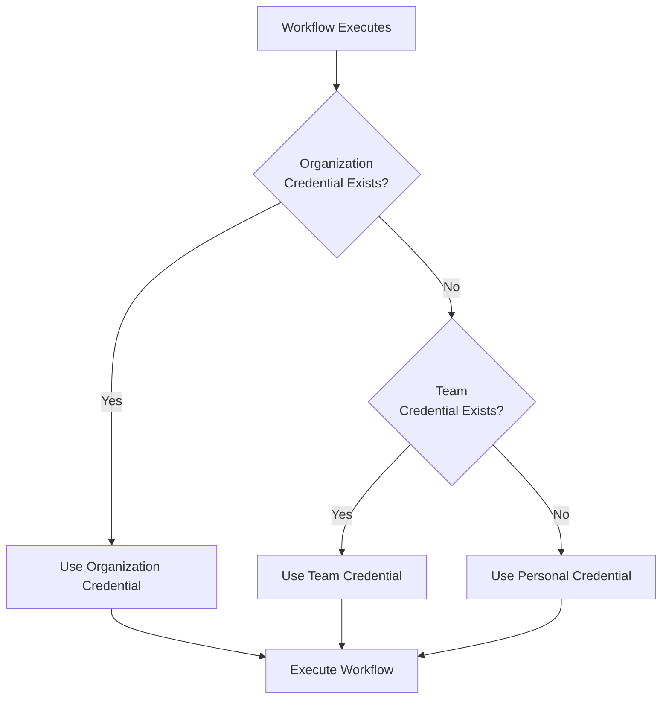
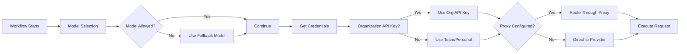

> ## Documentation Index
> Fetch the complete documentation index at: https://docs.gumloop.com/llms.txt
> Use this file to discover all available pages before exploring further.

# AI Model Governance & Configuration

AI Model Governance & Configuration provides enterprise organizations with comprehensive control over AI usage, credentials, and routing. These features enable administrators to implement security policies, manage costs, ensure compliance, and maintain centralized control over AI automation workflows.

## What You Can Control

<CardGroup cols={3}>
  <Card title="Model Restrictions, Presets & Fallbacks" icon="shield-check">
    Restrict which models members can use, set the default agent presets, and configure fallbacks
  </Card>

  <Card title="API Keys & Proxies" icon="key">
    Centrally manage AI provider API keys and proxy routing
  </Card>

  <Card title="AI Proxy Routing" icon="route">
    Route AI requests through custom proxy URLs
  </Card>
</CardGroup>

Together, these features provide complete governance over AI usage within your organization while maintaining the flexibility and power of Gumloop's automation platform.

***

## AI Model Access Control

Control which AI models your organization can use, set the default agent presets, and configure fallbacks for restricted models. These settings apply to everyone in your organization.

<Note>
  **Available at:** [gumloop.com/settings/organization/models](https://gumloop.com/settings/organization/models)
</Note>

The **Models** page has three tabs: **Restrictions**, **Presets**, and **Fallbacks**.

### Restrictions

Decide exactly which models your members can use. Turn on **Model access control** with the "restrict models?" toggle, then pick an access mode.

<Frame>
  
</Frame>

* **Allow Only Selected**: members can use only the models you check. Best for compliance-heavy organizations that permit a fixed, approved set.
* **Block Selected**: members can use every model except the ones you check. Best for general access with a few targeted exclusions.

Models are grouped by provider (Anthropic, OpenAI, Google, and more) with running **allowed** and **denied** counts. You can select or clear a whole provider at once, or search for a specific model.

<Note>
  Restrictions here set the **organization-wide ceiling**. To narrow model access further for specific groups of users, give each [Custom Role](/enterprise-features/user_groups#models-tab) its own model allow-list. A role can only allow models that are already permitted org-wide, and role-restricted models are hidden from the agent and workflow AI node pickers for those members.
</Note>

### Presets

Agents choose a model through three presets: **Recommended**, **Smartest**, and **Fastest**. On this tab you set which model each preset maps to for your whole organization, so members see your choices in the agent model picker instead of the Gumloop defaults.

<Frame>
  
</Frame>

By default, Recommended is the best balance of speed, quality, and cost, Smartest maximizes intelligence for complex tasks, and Fastest is optimized for speed and low latency. Override any of them to standardize on the models your organization prefers.

### Fallbacks

When a flow or agent references a model that is now restricted, Gumloop uses a fallback instead of failing.

<Frame>
  
</Frame>

* **Fallback Model**: the model existing flows fall back to when they reference a restricted model.
* **Image Generation Fallback Model**: the model used for image generation when the selected image model is restricted.

### Common Use Cases

<Tabs>
  <Tab title="Compliance">
    Enable **Allow Only Selected**, permit only models that meet your data residency and regulatory requirements (HIPAA, GDPR, and so on), and set a compliant **Fallback Model** so restricted references keep working.
  </Tab>

  <Tab title="Standardization">
    Use **Presets** to point Recommended, Smartest, and Fastest at the exact models your organization has approved, so every agent uses consistent models without each builder choosing their own.
  </Tab>
</Tabs>

***

## API Keys & Proxies

Centrally manage AI provider API keys at the organization level. When configured, these credentials automatically override personal and team credentials across your entire organization. This page is also where you configure AI proxy routing (see below).

<Note>
  **Available at:** [gumloop.com/settings/organization/api-keys](https://gumloop.com/settings/organization/api-keys)

  Enterprise OAuth client configurations for services like Snowflake, Databricks, Okta, and NetSuite now live on a separate page: [OAuth Configuration](https://gumloop.com/settings/organization/oauth-configuration).
</Note>

<div align="center">
  
</div>

### How It Works

Organization credentials follow this hierarchy:



<Info>
  Organization credentials **always take priority** over both team and personal credentials. This ensures consistent billing, access control, and compliance across all workflows in your organization.
</Info>

### Supported Providers

| Provider          | API Key Type | What You Get                                                                                                                                                  |
| ----------------- | ------------ | ------------------------------------------------------------------------------------------------------------------------------------------------------------- |
| **OpenAI**        | API Key      | Access to GPT models and OpenAI services                                                                                                                      |
| **Anthropic**     | API Key      | Access to Claude models                                                                                                                                       |
| **Perplexity**    | API Key      | Access to Perplexity AI models                                                                                                                                |
| **SpaceXAI**      | API Key      | Access to Grok models                                                                                                                                         |
| **Google Gemini** | API Key      | Access to Gemini models                                                                                                                                       |
| **Fireworks AI**  | API Key      | Access to the open models Gumloop serves through Fireworks: DeepSeek V4 Flash, DeepSeek V4 Pro, Kimi K3, Kimi K2.7 Code, GLM-5.2, MiniMax M3, and Qwen3.8 Max |

<Note>
  A **Fireworks AI** organization key applies to both agents and workflow AI nodes, and earns the same [BYOK](/core-concepts/ai_models#bring-your-own-key-byok) credit discount as any other provider key. It does not affect models served by other providers, so GPT-OSS 120B, Qwen3.5 397B, and Kimi K2.6 are not covered by it.
</Note>

### Setup Process

<Steps>
  <Step title="Add New AI Credential" icon="plus">
    <div align="center">
      
    </div>

    Click "Add Credential" and select your AI provider (OpenAI, Anthropic, Google Gemini, Perplexity, SpaceXAI, or Fireworks AI). Choose "API Key" as the credential type.
  </Step>

  <Step title="Configure Your API Key" icon="key">
    Enter your organization's API key for the selected provider. Configure any provider-specific settings as needed.

    <Warning>
      Keep your API keys secure. Never share them in documentation, code repositories, or public channels.
    </Warning>
  </Step>
</Steps>

### Key Benefits

<CardGroup cols={2}>
  <Card title="Unified Access" icon="users">
    All members automatically use organization API keys. No need for individual key management across teams.
  </Card>

  <Card title="Cost Control" icon="dollar-sign">
    Centralized billing for all AI usage. Track consumption across teams and simplify budget management.
  </Card>

  <Card title="Security" icon="shield-halved">
    All AI calls use audited and compliant credentials. Maintain consistent security policies across workflows.
  </Card>

  <Card title="Governance" icon="gavel">
    Prevent unauthorized AI usage through personal credentials. Ensure all usage goes through approved channels.
  </Card>
</CardGroup>

***

## AI Proxy Routing

Route AI provider requests through custom proxy URLs to use your own infrastructure, implement security policies, or integrate with specialized AI gateways.

### Core Features

<AccordionGroup>
  <Accordion title="Custom Proxy URLs" icon="server">
    Route all requests through organization-controlled proxy servers. Direct traffic through your own infrastructure for complete control over AI interactions.
  </Accordion>

  <Accordion title="Model Name Mapping" icon="diagram-project">
    Map Gumloop model names to custom proxy model identifiers. Use your own model naming conventions while maintaining compatibility with existing workflows.
  </Accordion>

  <Accordion title="Provider-Specific Configuration" icon="sliders">
    Configure different proxies for different AI providers. Customize routing based on your infrastructure and compliance requirements.
  </Accordion>
</AccordionGroup>

### Setup Process

<Steps>
  <Step title="Access Proxy Configuration" icon="gear">
    <div align="center">
      
    </div>

    Navigate to the [API Keys & Proxies page](https://gumloop.com/settings/organization/api-keys), find your AI provider credential (OpenAI, Anthropic, etc.), and click "Configure Proxy".

    <Note>The "Configure Proxy" button only appears for AI provider credentials.</Note>
  </Step>

  <Step title="Set Your Proxy URL" icon="link">
    Enter your custom proxy base URL (e.g., `https://your-proxy.company.com`). This URL will replace the default AI provider endpoint.

    <Warning>Your proxy URL must be accessible from Gumloop infrastructure. A proxy only takes effect when a key exists for that provider (the organization key, or the member's own key).</Warning>

    <Note>Requests that run through your proxy skip Gumloop's shared AI response cache, so every call reaches your own infrastructure.</Note>
  </Step>

  <Step title="Configure Model Mappings (Optional)" icon="route">
    <div align="center">
      
    </div>

    Map Gumloop model names to your proxy-specific model identifiers. For example, map `gpt-4` to `custom-gpt-4-enterprise` if your proxy uses non-standard model names.

    <Note>For Fireworks, the Gumloop model name is the full Fireworks id, such as `accounts/fireworks/models/glm-5p2` or `accounts/fireworks/routers/kimi-k3-us`. Map that id to whatever name your gateway expects; the mapped name is only used on the wire, while credits and usage are still tracked under the Gumloop model.</Note>
  </Step>
</Steps>

### Common Scenarios

<Tabs>
  <Tab title="Enterprise Gateway">
    **Corporate AI Management Platform**

    Route through your corporate AI gateway for:

    * Centralized logging and monitoring
    * Unified cost tracking across all AI usage
    * Consistent security policies
    * Compliance with corporate standards
  </Tab>

  <Tab title="Custom Models">
    **Organization-Specific AI Models**

    Access your fine-tuned models:

    * Route to custom endpoints for specialized models
    * Map standard names to your model variants
    * Maintain workflow compatibility
    * Use organization-trained AI models
  </Tab>

  <Tab title="Compliance">
    **Data Residency & Regulations**

    Meet compliance requirements:

    * Keep all AI requests within geographic regions
    * Route through compliant infrastructure
    * Maintain audit trails for regulatory needs
    * Ensure data never leaves approved locations
  </Tab>
</Tabs>

### Configuration Examples

<AccordionGroup>
  <Accordion title="Basic Proxy Setup">
    ```text theme={"dark"}
    Proxy URL: https://ai-gateway.company.com/v1
    Model Mappings: (none - use default model names)
    ```

    Simple routing through your gateway without custom model names.
  </Accordion>

  <Accordion title="Custom Model Names">
    ```text theme={"dark"}
    Proxy URL: https://custom-ai.company.com/api
    Model Mappings:
      gpt-4 → company-gpt-4-tuned
      gpt-3.5-turbo → company-gpt-35-fast
      claude-3-opus → company-claude-opus
      accounts/fireworks/models/glm-5p2 → company-glm-52
    ```

    Map Gumloop model names to your organization's custom model identifiers.
  </Accordion>

  <Accordion title="Regional Compliance">
    ```text theme={"dark"}
    Proxy URL: https://eu-ai-proxy.company.com/v1
    Model Mappings: (none - standard names with EU routing)
    ```

    Route through EU infrastructure for GDPR compliance while using standard model names.
  </Accordion>
</AccordionGroup>

***

## How These Features Work Together

When a workflow executes that requires AI, here's what happens:



<Steps>
  <Step title="Model Selection">
    AI Model Access Control determines which models are available based on your allow/deny list configuration.
  </Step>

  <Step title="Credential Resolution">
    Organization API keys (from the API Keys & Proxies page) provide authentication, overriding any team or personal credentials.
  </Step>

  <Step title="Request Routing">
    AI Proxy Routing determines the endpoint and applies any model name mappings before execution.
  </Step>

  <Step title="Execution">
    The request is sent through the configured proxy (if any) with organization credentials to the AI provider.
  </Step>
</Steps>

***

## Security and Compliance

<CardGroup cols={2}>
  <Card title="Access Control" icon="lock">
    Configuring AI model access requires the **Admin** or **Security** organization role. See [Organization Roles](/core-concepts/organization_user_roles#security) for the full assignment matrix.
  </Card>

  <Card title="Data Security" icon="shield">
    Encrypted storage for all credentials and configurations with secure transmission protocols.
  </Card>

  <Card title="Audit Logging" icon="file-lines">
    All administrative actions are logged for compliance and security monitoring.
  </Card>

  <Card title="Enterprise Ready" icon="building">
    Built for organizations with strict compliance and governance requirements.
  </Card>
</CardGroup>

***

## Need Help?

For additional support or questions about AI Model Governance & Configuration:

* **Email:** [support@gumloop.com](mailto:support@gumloop.com)
* **Slack:** Reach out in your dedicated support channel

## Related Documentation

<CardGroup cols={3}>
  <Card title="Custom Roles" icon="user-tag" href="/enterprise-features/user_groups">
    Manage organizational roles and permissions
  </Card>

  <Card title="Usage Data Export" icon="download" href="/enterprise-features/organization_data_export">
    Export and analyze usage data
  </Card>

  <Card title="Organizations & Teams" icon="building" href="/core-concepts/teams">
    Understanding organizational structure
  </Card>
</CardGroup>
