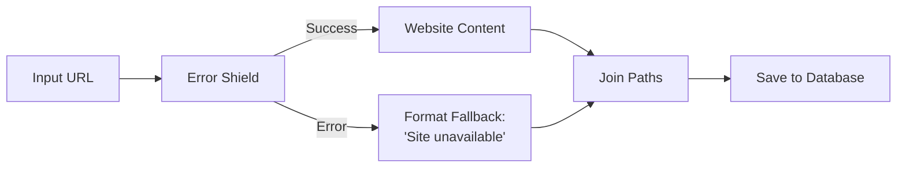

> ## Documentation Index
> Fetch the complete documentation index at: https://docs.gumloop.com/llms.txt
> Use this file to discover all available pages before exploring further.

# Error Shield

The Error Shield node protects your workflows by catching and handling errors gracefully. Instead of letting your entire workflow crash when something goes wrong, Error Shield catches the error and lets you decide what happens next.

## Overview

Think of Error Shield as a safety net for risky operations. When you wrap a node with Error Shield, it creates two possible outcomes: a success path for data that processes correctly, and an error path for handling failures.

<CardGroup cols={2}>
  <Card title="Prevent Workflow Crashes" icon="shield-halved">
    Catch errors before they stop your entire automation
  </Card>

  <Card title="Handle Failures Gracefully" icon="route">
    Define custom logic for errors instead of generic failure messages
  </Card>

  <Card title="Track Failed Items" icon="list-check">
    Identify which specific inputs caused problems in Loop Mode
  </Card>

  <Card title="Continue Processing" icon="forward">
    Keep your workflow running even when some items fail
  </Card>
</CardGroup>

## How It Works

Error Shield wraps around other nodes and monitors their execution. When the wrapped node processes data:

* **Success**: Output workflows to the Success Path
* **Failure**: Output workflows to the Error Path (original input if "Pass Inputs Through" is enabled)

<div align="center">
  
</div>

This image shows how "Pass Inputs Through" sends the original input to the error path, and how Join Paths merges both success and error paths back together to continue the workflow.

**Try it yourself**: [View and clone this example workflow](https://www.gumloop.com/pipeline?workbook_id=dFkxAUGr3tZ9WVnzgHwYhi)

## Configuration

<AccordionGroup>
  <Accordion title="Wrapped Node" icon="cube">
    The node you want to protect from errors. Simply drag a node inside the Error Shield container to wrap it.
  </Accordion>

  <Accordion title="Pass Inputs Through" icon="toggle-on">
    When enabled, the Error Path receives the original input that caused the error instead of an error message. This is essential when you need to:

    * Log which specific items failed
    * Retry failed items later
    * Format fallback data based on the original input

    **Example**: If scraping "[https://broken-site.com](https://broken-site.com)" fails, the Error Path receives "[https://broken-site.com](https://broken-site.com)" instead of just an error message.
  </Accordion>
</AccordionGroup>

## Outputs

<Tabs>
  <Tab title="Success Path">
    Contains data that was successfully processed by the wrapped node.

    **Single Item**: The processed result

    **Loop Mode**: A list containing only the successfully processed items
  </Tab>

  <Tab title="Error Path">
    Triggered when the wrapped node encounters an error.

    **Without "Pass Inputs Through"**: Error message or empty output

    **With "Pass Inputs Through"**: The original input(s) that caused the error
  </Tab>
</Tabs>

## Critical Behavior in Loop Mode

Understanding how Error Shield behaves in Loop Mode is essential for building reliable workflows.

### Node NOT in Loop Mode

When the wrapped node is **not** in Loop Mode, Error Shield processes a single item at a time:

```text theme={"dark"}
Website Scraper (Normal Mode) wrapped in Error Shield
Input: "https://example.com"

If successful:
✅ Success Path: Scraped content
❌ Error Path: Not triggered

If failed:
❌ Success Path: Not triggered (workflow stops here)
✅ Error Path: "https://example.com" (if Pass Inputs Through enabled)
```

<Warning>
  **Without Loop Mode, a single failure stops the workflow at the Error Shield.** To continue processing after an error, you must use Join Paths to reconnect the error path back into your workflow.
</Warning>

<div align="center">
  
</div>

### Node in Loop Mode

When the wrapped node **is** in Loop Mode, Error Shield processes each item individually and continues even when some items fail:

```text theme={"dark"}
Website Scraper (Loop Mode) wrapped in Error Shield
Input: [
  "https://site1.com",
  "https://site2.com" (fails),
  "https://site3.com",
  "https://site4.com" (fails)
]

Results:
✅ Success Path: [site1 content, site3 content]
❌ Error Path: ["https://site2.com", "https://site4.com"]
```

<Tip>
  **Loop Mode automatically skips failed iterations.** The Success Path contains only successful results, while the Error Path captures all failed inputs. The workflow continues processing remaining items even after failures.
</Tip>

<div align="center">
  
</div>

## Working with Join Paths

To continue your workflow after handling errors, use the Join Paths node to merge success and error paths back together.

### Basic Pattern: Single Item Processing

When processing individual items (not in Loop Mode), you need Join Paths to continue the workflow after an error:

<Steps>
  <Step title="Enable Pass Inputs Through">
    Turn on "Pass Inputs Through" in Error Shield to access the original input on the error path
  </Step>

  <Step title="Format Fallback Data">
    On the error path, create fallback data or a message indicating the failure

    **Example**: Use Combine Text to create "Failed to process: \[original input]"
  </Step>

  <Step title="Join the Paths">
    Connect both success and error paths to a Join Paths node to reunite them
  </Step>

  <Step title="Continue Workflow">
    After Join Paths, continue with the rest of your workflow logic
  </Step>
</Steps>

**Workflow Diagram**:



**Error Shield Example with Join Paths**: [View and clone this example workflow](https://www.gumloop.com/pipeline?workbook_id=dFkxAUGr3tZ9WVnzgHwYhi)

<Info>
  Without Join Paths, the error path would be a dead end, and your workflow would stop when an error occurs.
</Info>

## Real-World Examples

<AccordionGroup>
  <Accordion title="Web Scraping with Error Handling" icon="globe">
    **Scenario**: Scrape product information from multiple websites, some of which may be down or blocked.

    **Setup**:

    1. List of product URLs → Website Scraper (Loop Mode) wrapped in Error Shield
    2. Success Path → Extract product details → Format as JSON
    3. Error Path (Pass Inputs Through enabled) → Log failed URLs to sheet
    4. Join Paths → Send summary email with results and failed URLs

    **Outcome**: Successfully scrapes available sites while documenting failures for manual review
  </Accordion>

  <Accordion title="Document Processing with Fallback" icon="file">
    **Scenario**: Process invoices from various sources, providing default values when extraction fails.

    **Setup**:

    1. Invoice PDF → Extract data (wrapped in Error Shield)
    2. Success Path → Format extracted data
    3. Error Path → Create record with "Manual review required" status
    4. Join Paths → Save to database

    **Outcome**: All invoices are logged, with failed extractions flagged for manual processing
  </Accordion>

  <Accordion title="API Calls with Retry Logic" icon="code">
    **Scenario**: Fetch user data from external API that occasionally times out.

    **Setup**:

    1. User ID → API call (wrapped in Error Shield)
    2. Success Path → Process user data
    3. Error Path → Wait 30 seconds → Retry API call (wrapped in second Error Shield)
    4. Second Success Path → Process user data
    5. Second Error Path → Log failure and notify admin
    6. Join Paths → Continue workflow

    **Outcome**: Automatic retry for transient failures, with notifications only for persistent errors
  </Accordion>

  <Accordion title="Batch Email Sending" icon="envelope">
    **Scenario**: Send personalized emails to customer list, tracking delivery failures.

    **Setup**:

    1. Customer list → Send Email node (Loop Mode) wrapped in Error Shield
    2. Success Path → Log successful sends to "Delivered" sheet
    3. Error Path (Pass Inputs Through) → Log failed emails to "Bounced" sheet with customer details
    4. Join Paths → Generate summary report

    **Outcome**: Emails sent to all valid addresses, with bounce list for cleaning up customer database
  </Accordion>
</AccordionGroup>

## Common Use Cases

<CardGroup cols={2}>
  <Card title="Web Scraping" icon="spider-web">
    Handle website timeouts, blocks, or invalid URLs without stopping your entire scraping job
  </Card>

  <Card title="File Processing" icon="file-lines">
    Continue processing a batch of files even if some are corrupted or in unexpected formats
  </Card>

  <Card title="API Integrations" icon="plug">
    Manage rate limits, timeouts, and invalid responses from external services
  </Card>

  <Card title="Data Validation" icon="circle-check">
    Process valid records while capturing and handling invalid ones separately
  </Card>
</CardGroup>

## Setup Guide

<Steps>
  <Step title="Add Error Shield to Canvas">
    Drag the Error Shield node from the Workflow Basics section onto your workflow canvas
  </Step>

  <Step title="Wrap Your Node">
    Place the node you want to protect inside the Error Shield container. The node will now be protected from errors.
  </Step>

  <Step title="Enable Pass Inputs Through (Optional)">
    Toggle this setting if you need to access the original input that caused errors. This is essential for:

    * Logging which specific items failed
    * Creating fallback data based on original input
    * Retrying failed operations
  </Step>

  <Step title="Connect Success Path">
    Wire the Success Path output to the next step in your workflow that should receive successfully processed data
  </Step>

  <Step title="Handle Error Path">
    Connect the Error Path to error handling logic:

    * Log failures to a database or sheet
    * Send notification alerts
    * Create fallback data
    * Format error messages for users
  </Step>

  <Step title="Use Join Paths (If Needed)">
    If both paths need to continue through the same workflow logic, add a Join Paths node to merge them back together
  </Step>

  <Step title="Test Both Paths">
    Run your workflow with both valid and invalid inputs to ensure both success and error paths work as expected
  </Step>
</Steps>

## Best Practices

<AccordionGroup>
  <Accordion title="Always Use with Risky Operations" icon="triangle-exclamation">
    Wrap any node that might fail in Error Shield:

    * External API calls
    * Web scraping
    * File operations
    * Database queries
    * Email sending
    * Data transformations on uncertain input formats
  </Accordion>

  <Accordion title="Enable Pass Inputs Through for Loop Mode" icon="list">
    When processing lists, always enable "Pass Inputs Through" so you can track which specific items failed and potentially retry them later.
  </Accordion>

  <Accordion title="Use Join Paths for Non-Loop Workflows" icon="code-merge">
    If the wrapped node is NOT in Loop Mode, use Join Paths to allow your workflow to continue after error handling. Without it, errors create dead ends in your workflow.
  </Accordion>

  <Accordion title="Consider Using Subflows" icon="diagram-project">
    For complex error handling in Loop Mode, wrap your entire processing logic in a subflow, then wrap the subflow in Error Shield. This keeps related data together and prevents list size mismatches.

    [Learn more about Subflows with Error Shield](https://docs.gumloop.com/common_errors/list_size_mismatch#the-solution-error-shield-around-subflow)
  </Accordion>
</AccordionGroup>

## Additional Resources

<CardGroup cols={2}>
  <Card title="Video Tutorial" icon="youtube" href="https://www.youtube.com/watch?v=3PpFDYBtsT8">
    Watch a step-by-step guide to using Error Shield
  </Card>

  <Card title="Join Paths Documentation" icon="book" href="https://docs.gumloop.com/nodes/flow_basics/join_paths">
    Learn how to merge conditional paths
  </Card>

  <Card title="Loop Mode Guide" icon="repeat" href="https://docs.gumloop.com/core-concepts/loop_mode">
    Understand how Loop Mode processes lists
  </Card>

  <Card title="List Size Mismatch Errors" icon="list" href="https://docs.gumloop.com/common_errors/list_size_mismatch">
    Fix common errors with Error Shield and Loop Mode
  </Card>
</CardGroup>
