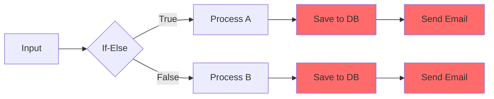
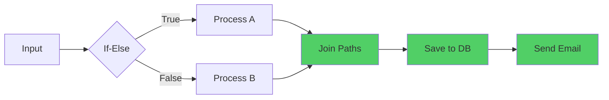
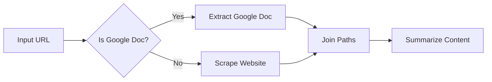
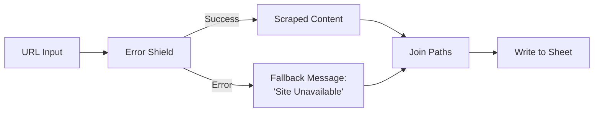
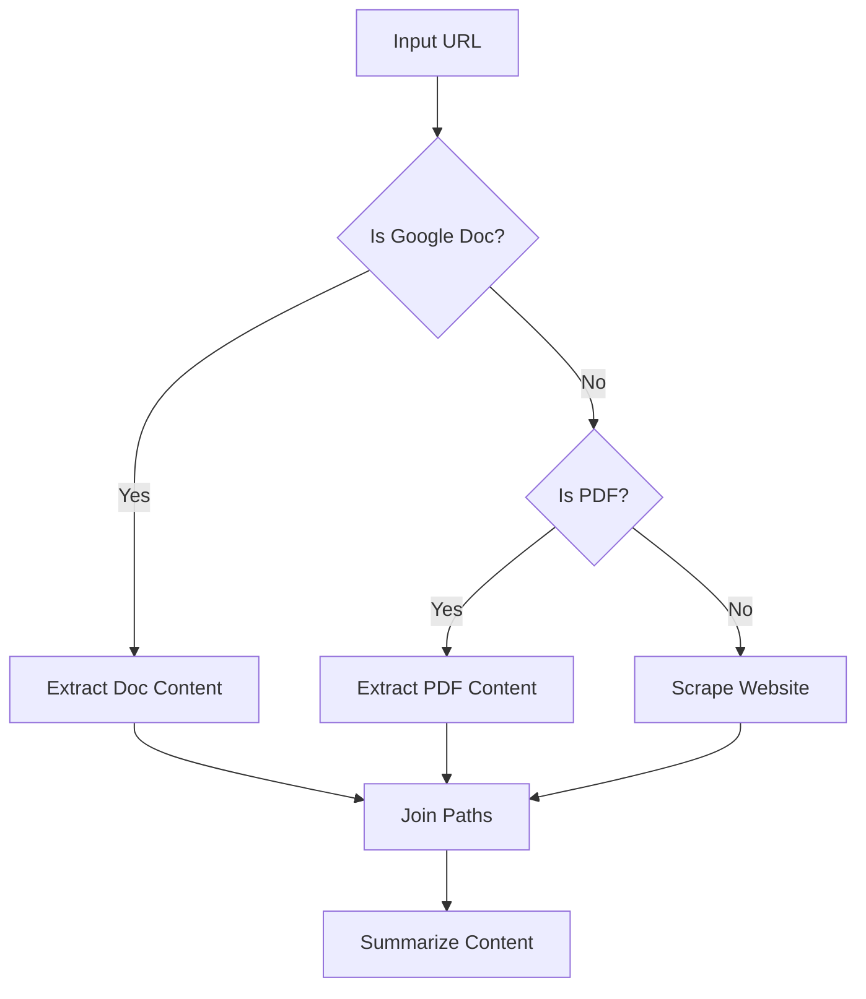
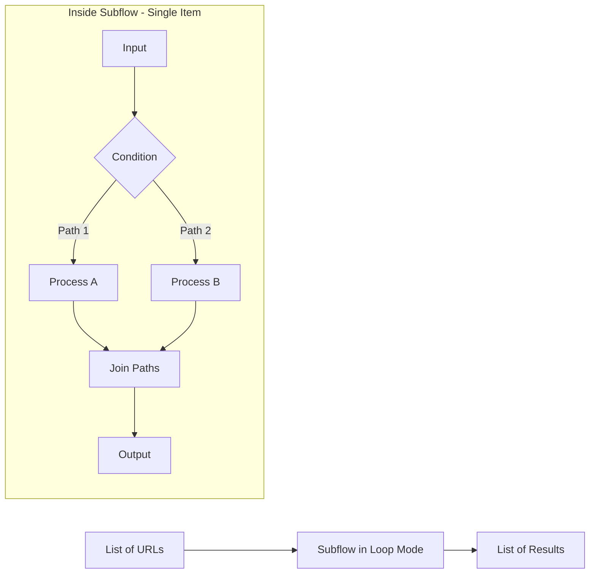

> ## Documentation Index
> Fetch the complete documentation index at: https://docs.gumloop.com/llms.txt
> Use this file to discover all available pages before exploring further.

# Join Paths

The Join Paths node reconnects multiple conditional paths in your workflow back into a single path. When you use If-Else, Router or Error Shield nodes that create branching logic, `Join Paths` eliminates the need for duplicate nodes by merging the paths back together.

## Overview

Think of Join Paths as a merge point in your workflow. After your workflow splits into different branches based on conditions, Join Paths brings the active branch back to continue processing through the same set of nodes.

<CardGroup cols={2}>
  <Card title="Eliminate Duplicate Nodes" icon="clone">
    No need to repeat the same nodes in each conditional branch
  </Card>

  <Card title="Cleaner Workflows" icon="diagram-project">
    Maintain single processing paths after conditions
  </Card>

  <Card title="Better Maintenance" icon="wrench">
    Update one set of nodes instead of multiple copies
  </Card>

  <Card title="Resource Efficiency" icon="gauge-high">
    Reduce redundant operations and simplify logic
  </Card>
</CardGroup>

## How It Works

Join Paths takes multiple input connections but only one path is active during runtime. The active path (determined by your conditional logic) workflows through Join Paths and continues to the next node.

  

**Key Concept**: Only the executed branch passes data through Join Paths. Non-executed paths are pruned (stopped) at the conditional node, so Join Paths never has to merge conflicting data.

## Configuration

<AccordionGroup>
  <Accordion title="Input 1 (Required)" icon="1">
    Connect the first potential execution path. This can be any data type (text, list, object, etc.)
  </Accordion>

  <Accordion title="Input 2 (Required)" icon="2">
    Connect the second potential execution path. Must match the data type of Input 1 to ensure consistency
  </Accordion>

  <Accordion title="Additional Inputs (Optional)" icon="plus">
    Add more input connections for complex branching scenarios with 3+ conditional paths. Click the "+" button to add additional inputs.

    **Example**: Processing Google Docs, PDFs, or websites requires 3 inputs on Join Paths
  </Accordion>
</AccordionGroup>

## Output

<Tabs>
  <Tab title="Continuation Path">
    **Data from Executed Branch**: Join Paths outputs whatever data comes from the active path

    **Type Preservation**: The original data type is maintained (if Input 1 sends text, output is text)

    **No Merging**: Join Paths does NOT combine data from multiple paths - only the active path workflows through
  </Tab>

  <Tab title="Pruned Paths">
    **Non-Executed Branches**: Paths that weren't triggered by the conditional logic are pruned (stopped) and don't reach Join Paths

    **No Dead Data**: You never have to worry about conflicting data from multiple paths because only one path is active at runtime
  </Tab>
</Tabs>

## When to Use Join Paths

<CardGroup cols={1}>
  <Card title="If-Else / Router Conditionals" icon="code-branch" href="#example-if-else-with-join-paths">
    Reconnect true/false branches after conditional logic
  </Card>

  <Card title="Error Shield Patterns" icon="shield-halved" href="#example-error-shield-with-join-paths">
    Merge success and error paths to continue workflow
  </Card>
</CardGroup>

## Why Join Paths Matters

Without Join Paths, you're forced to duplicate nodes after every conditional split:

Using Join Paths eliminates duplication by merging paths back together:

## Example Workflows

### Example: If-Else with Join Paths

**Scenario**: Processing content from either Google Docs or websites

**Try it yourself**: [View and clone this example workflow](https://www.gumloop.com/pipeline?workbook_id=e6pr4uX6Ki67rfqCH9cfRj)

<Steps>
  <Step title="Receive URL Input">
    User provides a URL that could be either a Google Doc or a regular website
  </Step>

  <Step title="Check Document Type">
    If-Else node determines if the URL is a Google Doc link
  </Step>

  <Step title="Extract Content Appropriately">
    * **True path**: Use Google Docs integration to extract content
    * **False path**: Use Website Scraper to get content
  </Step>

  <Step title="Merge Paths">
    Join Paths combines both extraction methods into a single continuation point
  </Step>

  <Step title="Process Uniformly">
    Single Summarize node handles content from either source
  </Step>
</Steps>

<Info>
  **Without Join Paths**, you'd need two separate Summarize nodes - one after the Google Doc extraction and one after the website scraping. With Join Paths, you only maintain one Summarize node.
</Info>

### Example: Error Shield with Join Paths

**Scenario**: Web scraping with error handling and result logging

**Try it yourself**: [View and clone this example workflow](https://www.gumloop.com/pipeline?workbook_id=dHSU1njW5f9x77NmUEQVsQ)

<Steps>
  <Step title="Protect Scraping Operation">
    Wrap Website Scraper in Error Shield to catch failures
  </Step>

  <Step title="Handle Success Path">
    Successfully scraped content workflows directly to Join Paths
  </Step>

  <Step title="Handle Error Path">
    Failed scrapes trigger error path, which creates a fallback message like "Site Unavailable"
  </Step>

  <Step title="Merge Results">
    Join Paths ensures both successful scrapes and error messages continue to the next step
  </Step>

  <Step title="Log All Results">
    Single "Write to Sheet" node logs both successful and failed attempts
  </Step>
</Steps>

<Tip>
  This pattern is essential for Error Shield usage when the node is NOT in Loop Mode. Without Join Paths, the error path becomes a dead end and the workflow stops.
</Tip>

### Example: Multi-Source Content Processor

**Scenario**: Handling different document types (Google Docs, PDFs, websites)

**Try it yourself**: [View and clone this example workflow](https://www.gumloop.com/pipeline?workbook_id=8y6UQLiZaPvHzFLrmYVeYm)

<Steps>
  <Step title="First Conditional Check">
    Check if input is a Google Doc URL
  </Step>

  <Step title="Second Conditional Check">
    If not a Google Doc, check if it's a PDF
  </Step>

  <Step title="Three Processing Paths">
    * **Google Doc**: Use Docs integration
    * **PDF**: Use PDF extraction
    * **Website**: Use web scraper
  </Step>

  <Step title="Merge All Paths">
    Join Paths with 3 inputs consolidates all document types
  </Step>

  <Step title="Unified Processing">
    Single Summarize node processes content regardless of original format
  </Step>
</Steps>

<Info>
  **Note**: When using multiple conditional checks, add additional inputs to Join Paths by clicking the "+" button. This example requires 3 input connections.
</Info>

## Loop Mode Limitations

<Warning>
  **Join Paths does NOT support Loop Mode.** Here's why and what to do instead.
</Warning>

### Why No Loop Mode?

Join Paths is designed for single-path execution where only one branch is active at a time. Loop Mode processes multiple items concurrently, which would create ambiguity:

* Which path's data should continue when multiple branches are active simultaneously?
* How should Join Paths handle item 1 taking the success path while item 2 takes the error path?
* What happens to synchronization between different loop iterations?

This limitation ensures predictable and reliable workflow execution.

### Solution: [Use Subflows](http://localhost:3001/core-concepts/subflows)

If you need to process multiple items with conditional logic:

<Steps>
  <Step title="Create a Subflow">
    Build your conditional logic and Join Paths inside a subflow that handles a single item
  </Step>

  <Step title="Test with Single Input">
    Verify the subflow works correctly with one item
  </Step>

  <Step title="Enable Loop Mode on Subflow">
    In your main workflow, enable Loop Mode on the subflow node itself (not on nodes inside the subflow)
  </Step>

  <Step title="Pass in List">
    Connect a list of items to the subflow, which will process each item through the conditional logic independently
  </Step>
</Steps>

**Example Pattern**:

<Tip>
  This approach maintains the benefits of Join Paths while efficiently processing multiple items. Each loop iteration runs the full conditional logic independently.
</Tip>

## Best Practices

<AccordionGroup>
  <Accordion title="Always Use After Conditional Splits" icon="code-branch">
    Whenever you create a branching condition (If-Else, Error Shield, Router), consider if the paths need to reunite for common processing. If yes, use Join Paths.
  </Accordion>

  <Accordion title="Match Data Types Across Inputs" icon="equals">
    Ensure all potential paths output the same data type to Join Paths:

    * If one path outputs text, all paths should output text
    * If one path outputs a list, all paths should output lists

    **Why?** The next node after Join Paths expects a consistent data type.
  </Accordion>

  <Accordion title="Use for Error Shield (Non-Loop Mode)" icon="shield-halved">
    When Error Shield wraps a node that's NOT in Loop Mode, always use Join Paths to:

    * Prevent error paths from becoming dead ends
    * Allow workflow to continue after error handling
    * Enable unified logging of both success and failure cases
  </Accordion>

  <Accordion title="Name Your Paths Clearly" icon="tag">
    Add clear labels to your conditional branches so you can easily identify which path data came from during debugging.
  </Accordion>

  <Accordion title="Test Each Branch Independently" icon="vial">
    Before connecting Join Paths:

    1. Test each conditional branch separately
    2. Verify each path produces the expected output type
    3. Then connect Join Paths and test the full workflow
  </Accordion>

  <Accordion title="For Lists, Use Subflows" icon="diagram-project">
    Don't try to use Join Paths directly in Loop Mode. Instead:

    * Create a subflow with conditional logic + Join Paths
    * Use Loop Mode on the subflow itself
    * Process lists efficiently while maintaining clean conditional logic
  </Accordion>
</AccordionGroup>

## Additional Resources

<CardGroup cols={1}>
  <Card title="Error Shield Documentation" icon="shield-halved" href="https://docs.gumloop.com/nodes/flow_basics/error_shield">
    Learn how to use Error Shield with Join Paths
  </Card>

  <Card title="Subflows Guide" icon="diagram-project" href="https://docs.gumloop.com/core-concepts/subflows">
    Use Join Paths with Loop Mode via subflows
  </Card>

  <Card title="Router Node" icon="route" href="https://docs.gumloop.com/nodes/flow_basics/router">
    Advanced multi-path routing for 3+ conditions
  </Card>
</CardGroup>
