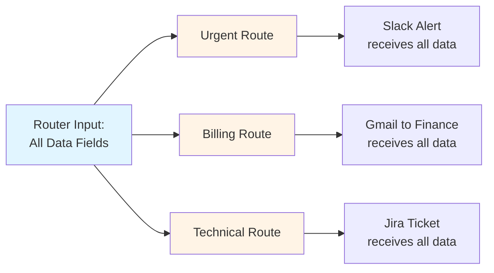

> ## Documentation Index
> Fetch the complete documentation index at: https://docs.gumloop.com/llms.txt
> Use this file to discover all available pages before exploring further.

# Router

The Router node enables smart conditional routing in your workflows by directing data through different paths based on AI decisions or logical conditions.

<div className="rounded-2xl overflow-hidden border border-pink-200 dark:border-pink-800">
  <iframe src="https://player.vimeo.com/video/1111151692?badge=0&autopause=0&player_id=0&app_id=58479" style={{ width: '100%', aspectRatio: '16/9' }} frameBorder="0" allow="autoplay; fullscreen; picture-in-picture; clipboard-write; encrypted-media" title="The Router Node" />
</div>

## What Does the Router Node Do?

The Router node acts as a **decision point** in your workflow, splitting your workflow into multiple paths and automatically choosing which path to follow. Think of it like an if-else statement, but significantly more powerful.

<CardGroup cols={2}>
  <Card title="Up to 8 Routes" icon="code-branch">
    Create multiple conditional paths instead of just if/else logic
  </Card>

  <Card title="AI-Powered Decisions" icon="brain">
    Use intelligent routing based on content understanding
  </Card>

  <Card title="Logical Conditions" icon="list-check">
    Apply precise rule-based routing with boolean operators
  </Card>

  <Card title="Automatic List Processing" icon="layer-group">
    Process batches with item-by-item evaluation
  </Card>
</CardGroup>

<div align="center">
  
</div>

**Real-World Example**: Processing incoming support tickets

* Route urgent tickets → Escalation team
* Route billing questions → Finance department
* Route general inquiries → Standard support queue

The Router evaluates each ticket and automatically sends it down the appropriate path.

***

## AI Routing vs Standard Routing

Choose the right routing mode based on whether your decisions require interpretation or can be defined with exact rules.

<CardGroup cols={2}>
  <Card title="AI Routing" icon="sparkles">
    **Use when you need content understanding**

    Best for analyzing sentiment, understanding context, categorizing nuanced content, and making subjective classifications.

    **Cost**: 2-30 credits based on the AI model
  </Card>

  <Card title="Standard Routing" icon="brackets-curly">
    **Use when you have clear criteria**

    Best for exact keyword matching, numerical comparisons, binary decisions, and deterministic routing.

    **Cost**: 0 credits (logic-based)
  </Card>
</CardGroup>

### Quick Comparison

| Aspect             | AI Routing                    | Standard Routing      |
| ------------------ | ----------------------------- | --------------------- |
| **Decision Logic** | Content interpretation        | Keyword/rule matching |
| **Consistency**    | Intelligent but may vary      | 100% deterministic    |
| **Setup**          | Natural language descriptions | Logical conditions    |
| **Best Use Case**  | Nuanced categorization        | Clear yes/no criteria |

<Tabs>
  <Tab title="AI Routing Details">
    ### When to Use AI Routing

    Use AI routing when your routing decisions require **content understanding and interpretation**.

    **Ideal scenarios:**

    * Analyzing sentiment or tone
    * Understanding context and intent
    * Categorizing nuanced content
    * Making subjective classifications

    **Example Configuration:**

    ```text theme={"dark"}
    Route 1: "Customer Complaint"
    AI Condition: "when the email expresses dissatisfaction, 
                   frustration, or requests a refund"

    Route 2: "Product Inquiry"  
    AI Condition: "when the email asks questions about features, 
                   pricing, or product information"

    Route 3: "Technical Support"
    AI Condition: "when the email reports bugs, technical issues, 
                   or requests help with setup"
    ```

    <Info>
      AI routing is **enabled by default**. You can select different AI models based on complexity, with credit costs ranging from 2-30 credits per routing decision.
    </Info>
  </Tab>

  <Tab title="Standard Routing Details">
    ### When to Use Standard Routing

    Use standard routing when you have **clear, measurable criteria** that can be defined with exact rules.

    **Ideal scenarios:**

    * Exact keyword matching
    * Numerical comparisons
    * Binary yes/no decisions
    * Deterministic routing (must be 100% consistent)

    **Example Configuration:**

    ```text theme={"dark"}
    Route 1: "Shopify Leads"
    Conditions:
    - website_content [Text] Contains "shopify"
    - OR website_content [Text] Contains "myshopify.com"

    Route 2: "Other Websites"  
    Conditions:
    - website_content [Text] Does not Contain "shopify"
    ```

    <Info>
      Standard routing uses **0 credits** since it's logic-based with no external API calls.
    </Info>
  </Tab>
</Tabs>

***

## Real-World Examples

<Tabs>
  <Tab title="AI Routing: Support Triage">
    ### Support Request Triage

    **[View Full Workflow →](https://gumloop.com/pipeline?workbook_id=2YiTXF7pcXBMgiaiSetQWT)**

    This workflow intelligently categorizes support requests using AI-powered routing.

    <Steps>
      <Step title="Read Emails">
        Gmail Reader pulls support emails from a specific label
      </Step>

      <Step title="AI Routing">
        Router analyzes content to understand intent and urgency
      </Step>

      <Step title="Route to Teams">
        Each route triggers different actions for appropriate teams
      </Step>
    </Steps>

    **Why AI Routing?**\
    Support requests require interpretation - the AI understands context, tone, and intent to determine urgency and category. Keywords alone can't capture this nuance.

    **Router Setup:**

    * **Route 1**: "General Questions" → Slack notification to general support
    * **Route 2**: "Billing Questions" → Email to finance team
    * **Route 3**: "Feature Request" → Create Linear ticket
  </Tab>

  <Tab title="Standard Routing: Lead Qualifier">
    ### Lead Website Analyzer

    **[View Full Workflow →](https://gumloop.com/pipeline?workbook_id=pkHL6gMqMhKKr3XifseevD)**

    This workflow qualifies leads by detecting specific website technologies using logical conditions.

    <Steps>
      <Step title="Read Prospects">
        Sheet Reader pulls prospect websites from Google Sheet
      </Step>

      <Step title="Scrape Content">
        Website Scraper extracts content from each website
      </Step>

      <Step title="Standard Routing">
        Router uses text conditions to detect platforms
      </Step>

      <Step title="Take Action">
        Qualified leads go to Slack, others receive Gmail rejection
      </Step>
    </Steps>

    **Why Standard Routing?**\
    This is deterministic - if scraped content contains specific Shopify keywords, it's definitely a Shopify store. No interpretation needed, just exact keyword matching for 100% consistency.

    **Router Setup:**

    * **Route 1**: "Shopify Leads" (Qualified) - Contains "shopify" OR "myshopify.com"
    * **Route 2**: "Other Websites" (Rejected) - Does not contain "shopify"
  </Tab>
</Tabs>

***

## Loop Mode Processing

### How It Works

When you pass a list to the Router, each item is evaluated separately and can be routed to different paths based on its individual characteristics.

**Example**: [View Loop Mode Workflow →](https://gumloop.com/pipeline?workbook_id=mj89U7XwiPqwJKEfHBPrsg)

```text theme={"dark"}
Input List: ["urgent ticket", "billing question", "general inquiry"]

Processing:
┌─────────────────────────┐
│ Item 1: "urgent ticket" │ → Routes to Support Team
├─────────────────────────┤
│ Item 2: "billing question" │ → Routes to Finance Team
├─────────────────────────┤
│ Item 3: "general inquiry" │ → Routes to General Team
└─────────────────────────┘

Result: Items distributed across different routes
```

This allows batch processing where each item in your list can take a different path based on its content.

***

## Configuration

### Required Inputs

<AccordionGroup>
  <Accordion title="Input to Evaluate" icon="crosshairs">
    The specific data field that determines which route to take. The Router analyzes this field to make routing decisions.

    **Example for support tickets:**

    * `ticket_description` - Route based on issue content
    * `priority_level` - Route based on urgency
    * `customer_tier` - Route based on customer status
  </Accordion>

  <Accordion title="Routes (Up to 8)" icon="route">
    The different paths your data can follow. Each route represents a distinct outcome or processing path.

    **Example for support system:**

    * Route 1: "Urgent" - High-priority issues
    * Route 2: "Billing Question" - Payment-related
    * Route 3: "Technical Support" - Product issues
    * Route 4: "General Inquiry" - Everything else
  </Accordion>
</AccordionGroup>

### Optional Settings

<AccordionGroup>
  <Accordion title="Route With AI" icon="toggle-on">
    Toggle between AI-powered routing and standard logical routing.

    **Default**: Enabled (AI Mode)

    **When to disable**: When you need deterministic, rule-based routing with zero credit cost
  </Accordion>

  <Accordion title="AI Model Selection" icon="microchip">
    Choose which AI model powers your routing decisions (only available in AI mode).

    **Model tiers:**

    * **Standard models**: 2 credits - Good for straightforward categorization
    * **Advanced models**: 20 credits - Better for complex decisions
    * **Expert models**: 30 credits - Best for nuanced interpretation
  </Accordion>
</AccordionGroup>

***

## Understanding Outputs

The Router creates separate output branches for each route. Each branch contains all the original inputs.

**Example Setup:**

```text theme={"dark"}
Inputs to Router:
├── ticket_description (used for routing decision)
├── ticket_title
├── ticket_link
└── customer_email

Routes Created (ie. available outputs):
├── Urgent Branch → [All 4 inputs]
├── Billing Question Branch → [All 4 inputs]
└── Technical Support Branch → [All 4 inputs]
```

### Visual Workflow



<Tip>
  This design ensures downstream nodes have full context - you don't lose related information when routing.
</Tip>

***

## Detailed Configuration Guide

<Tabs>
  <Tab title="AI Routing Setup">
    ### Configuring AI Routing

    <div align="center">
      
    </div>

    <Steps>
      <Step title="Ensure AI Mode is Enabled">
        "Route With AI" should be toggled ON (this is the default)
      </Step>

      <Step title="Select Input to Evaluate">
        Choose which data field the AI should analyze for routing
      </Step>

      <Step title="Create Routes">
        Add up to 8 routes with clear, descriptive names
      </Step>

      <Step title="Write AI Conditions">
        Describe in natural language when each route should be used (optional but recommended)
      </Step>

      <Step title="Choose AI Model">
        Select model based on decision complexity
      </Step>
    </Steps>

    ### Best Practices

    <CardGroup cols={2}>
      <Card title="Descriptive Route Names" icon="tag">
        ✅ "Positive Review", "Negative Review"\
        ❌ "Route A", "Route B"

        Even without conditions, AI infers logic from clear names
      </Card>

      <Card title="Clear AI Conditions" icon="comment-dots">
        ✅ "expresses anger, frustration, or demands action"\
        ❌ "negative sentiment"

        Give AI enough context for accurate decisions
      </Card>

      <Card title="Right Model Selection" icon="sliders">
        Match model power to complexity:

        * Simple categorization → Standard
        * Nuanced interpretation → Expert
      </Card>

      <Card title="Include Examples" icon="lightbulb">
        <div align="center">
          
        </div>
      </Card>
    </CardGroup>
  </Tab>

  <Tab title="Standard Routing Setup">
    ### Configuring Standard Routing

    <Steps>
      <Step title="Disable AI Mode">
        Toggle "Route With AI" to OFF
      </Step>

      <Step title="Create Named Routes">
        Add routes with descriptive names
      </Step>

      <Step title="Build Logical Conditions">
        Use condition operators to define routing rules
      </Step>

      <Step title="Apply Boolean Logic">
        Combine conditions with AND/OR operators
      </Step>

      <Step title="Order Routes Correctly">
        Place most specific conditions first (top to bottom evaluation)
      </Step>
    </Steps>

    ### Available Condition Types

    <AccordionGroup>
      <Accordion title="General Conditions" icon="asterisk">
        | Condition      | Description            |
        | -------------- | ---------------------- |
        | `Is empty`     | Field contains no data |
        | `Is not empty` | Field contains data    |
      </Accordion>

      <Accordion title="Text Conditions" icon="font">
        | Condition                        | Description                                    |
        | -------------------------------- | ---------------------------------------------- |
        | `Equals`                         | Exact match (case-sensitive)                   |
        | `Does not equal`                 | Not an exact match                             |
        | `Contains`                       | Includes substring                             |
        | `Does not contain`               | Does not include substring                     |
        | `Starts with`                    | Begins with string                             |
        | `Ends with`                      | Ends with string                               |
        | `Is in`                          | Entire value appears in condition text         |
        | `Is not in`                      | Entire value does NOT appear in condition text |
        | `Is greater than [n] characters` | Length exceeds number                          |
        | `Is less than [n] characters`    | Length under number                            |
        | `Matches regex`                  | Matches regex pattern                          |
        | `Does not match regex`           | Does not match regex                           |
      </Accordion>

      <Accordion title="Number Conditions" icon="calculator">
        | Condition                     | Description        |
        | ----------------------------- | ------------------ |
        | `Equals`                      | Exact number match |
        | `Is not equal to`             | Not exact match    |
        | `Is greater than`             | Larger than value  |
        | `Is less than`                | Smaller than value |
        | `Is greater than or equal to` | Greater or equal   |
        | `Is less than or equal to`    | Less or equal      |
      </Accordion>
    </AccordionGroup>
  </Tab>
</Tabs>

***

## Best Practices

<Tabs>
  <Tab title="General">
    <CardGroup cols={2}>
      <Card title="Start Simple" icon="seedling">
        Begin with 2-3 routes, add complexity gradually as you test and validate
      </Card>

      <Card title="Test Thoroughly" icon="flask">
        Validate routing with diverse sample data including edge cases
      </Card>

      <Card title="Descriptive Naming" icon="pen">
        Clear route names improve debugging and maintenance significantly
      </Card>

      <Card title="Always Add Fallback" icon="shield">
        Include a catch-all route at the bottom to handle unmatched items
      </Card>

      <Card title="Order Matters" icon="arrow-down-1-9">
        Place specific conditions first, general conditions last
      </Card>

      <Card title="Monitor Run Logs" icon="chart-line">
        Check logs regularly to verify routing behavior
      </Card>
    </CardGroup>
  </Tab>

  <Tab title="AI Routing">
    ### AI-Specific Guidelines

    **Model Selection**

    * Match model complexity to routing difficulty
    * Start with standard models, upgrade only if needed
    * More powerful models = higher accuracy but more credits

    **Condition Writing**

    * Provide context: explain what characteristics define each route
    * Use examples: "emails expressing anger, frustration, or urgency"
    * Be specific: avoid vague terms like "bad" or "negative"
    * Test consistency: run same input multiple times to check variance

    **Optimization**

    * Descriptive route names help even without explicit conditions
    * Include edge case examples in your AI conditions
    * Review misrouted items to refine conditions
  </Tab>

  <Tab title="Standard Routing">
    ### Logic-Based Guidelines

    **Condition Order**

    * Most specific conditions first
    * Broad catch-all conditions last
    * Sequential evaluation means order is critical

    **Data Validation**

    * Verify input data types match expected formats
    * Clean data before routing (trim whitespace, normalize case)
    * Use type conversion nodes if needed

    **Boolean Logic**

    * Combine related conditions with AND/OR effectively
    * Test each condition independently before combining
    * Document complex logic for future maintenance
  </Tab>
</Tabs>

***

## Troubleshooting

<AccordionGroup>
  <Accordion title="&#x22;No route matched&#x22; Error" icon="triangle-exclamation">
    **Problem**: An item didn't match any route conditions.

    **Solutions:**

    * Add a fallback route with opposite conditions to catch unmatched items
    * Review your conditions - may be too restrictive
    * Check input data for unexpected formats or values

    **Prevention:**

    * Always include a catch-all route at the bottom
    * Test with diverse sample data including edge cases
  </Accordion>

  <Accordion title="&#x22;Input type mismatch&#x22; Error" icon="circle">
    **Problem**: Inputs being evaluated are different types (e.g., mixing text and lists).

    **Solutions:**

    * Ensure all inputs are the same type
    * Use data conversion nodes before the Router
    * Check upstream nodes for unexpected output types

    **Prevention:**

    * Validate data types in testing
    * Use consistent data structures throughout workflow

    [More details on type mismatch →](https://docs.gumloop.com/common_errors/type_mismatch)
  </Accordion>

  <Accordion title="&#x22;List size mismatch&#x22; Error" icon="list-ul">
    **Problem**: List inputs have different lengths.

    **Solutions:**

    * Use Duplicate node to match list sizes
    * Filter lists to same length before routing
    * Verify upstream list generation

    **Prevention:**

    * Check list lengths in testing
    * Ensure list-generating nodes produce consistent outputs

    [More details on list size mismatch →](https://docs.gumloop.com/common_errors/list_size_mismatch)
  </Accordion>
</AccordionGroup>

### Debugging Checklist

<CardGroup cols={2}>
  <Card title="Check Run Logs" icon="magnifying-glass-chart">
    Monitor which routes are being selected and verify expected behavior

    [View Run Logs Documentation →](https://docs.gumloop.com/core-concepts/run_log)
  </Card>

  <Card title="Test Simple Cases First" icon="vial">
    Start with clear-cut examples before testing edge cases
  </Card>

  <Card title="Validate Input Data" icon="clipboard-check">
    Ensure data is clean, properly formatted, and matches expected types
  </Card>

  <Card title="Use Descriptive Names" icon="tags">
    Clear route names make debugging significantly easier
  </Card>
</CardGroup>

***

## Need Help?

<CardGroup cols={1}>
  <Card title="Contact Support" icon="comments" href="https://portal.usepylon.com/gumloop/forms/help">
    Need help? Reach out to us and we'll assist you.
  </Card>
</CardGroup>
