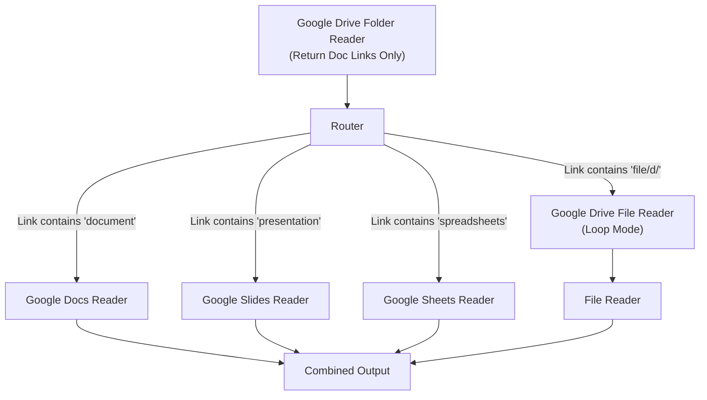
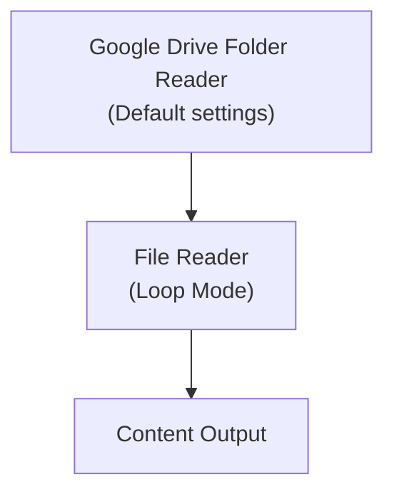

> ## Documentation Index
> Fetch the complete documentation index at: https://docs.gumloop.com/llms.txt
> Use this file to discover all available pages before exploring further.

# Google Drive Folder Reader

The Google Drive Folder Reader node enables automated content extraction from multiple files in a Google Drive folder. This node is particularly powerful for batch processing documents, images, and data files stored in Google Drive.

## Table of Contents

* [Quick Start](#quick-start)
* [Node Configuration](#node-configuration)
* [Output Types & Link Options](#output-types--link-options)
* [Processing Different File Types](#processing-different-file-types)
* [Example Workflows](#example-workflows)
* [Trigger Functionality](#trigger-functionality)
* [Best Practices](#best-practices)

## Quick Start

Choose your approach based on your situation:

| Your Situation                          | Configuration                    | Next Node                | Example Workflow                                                                    | Why This Works                          |
| --------------------------------------- | -------------------------------- | ------------------------ | ----------------------------------------------------------------------------------- | --------------------------------------- |
| **Small folder, want file content**     | Keep default settings            | File Reader (Loop Mode)  | [View Example](https://www.gumloop.com/pipeline?workbook_id=uZT4TBdNgoYaKNwDJFKZ2b) | Simple setup, gets content directly     |
| **Large folder, need speed**            | Enable "Return Drive Links Only" | Google Drive File Reader | [View Example](https://www.gumloop.com/pipeline?workbook_id=qCBGaLAQtFJRNEnQJnHRHv) | Fast folder scan, then download files   |
| **Mixed file types (Docs, PDFs, etc.)** | Enable "Return Doc Links Only"   | Router node              | [View Example](https://www.gumloop.com/pipeline?workbook_id=cQAUbZZeqrNnzYGcgnvSZd) | Routes each file type to best processor |

## Node Configuration

<div align="center">
  
</div>

### Folder Selection

Choose one method to specify your folder:

* **Select Folder**: Browse and select from your Google Drive
* **Use Link**: Paste a direct Google Drive folder URL

### Core Options

#### Read All Subfolders

* **When enabled**: Reads files from all nested subfolders recursively
* **When disabled**: Reads only files from the selected folder
* **Performance**: Can significantly increase processing time for deeply nested structures
* **Note**: Not available when using the node as a trigger

#### Link Return Options

<div align="center">
  
</div>

These options make the node run **significantly faster** by returning links instead of downloading the files:

**Return Drive Links Only**

* **Output**: `drive.google.com` links for ALL files (G Suite and non-G Suite)
* **Best for**: Large folders where you want consistent link format
* **Performance**: Fastest option available

**Return Doc Links Only**

* **Output**:
  * G Suite files (Docs, Sheets, Slides): `docs.google.com` links
  * Non-G Suite files: `drive.google.com` links
* **Best for**: Mixed file types requiring different processing paths
* **Performance**: Fast, with automatic file type routing

## Output Types & Link Options

### Default Output (No Link Options Enabled)

```text theme={"dark"}
Output: File objects that can be directly connected to:
✓ File Reader, PDF Reader
✓ Slack Message Sender, Gmail Sender (as attachments)
✓ AI Analyze Image, Analyze Video nodes
```

> Note: Total folder size limit of 400 MB applies when downloading files directly.

### With Link Options Enabled

```text theme={"dark"}
Output: Text links that require additional processing:
✓ Google Drive File Reader → File objects
✓ Google Docs/Sheets/Slides Reader → Content
✓ Router → Conditional processing
```

## Processing Different File Types

### Method 1: Fast Link-Based Processing (Recommended for Large Folders)

**Example Workflow**: [Mixed File Type Processing](https://www.gumloop.com/pipeline?workbook_id=cQAUbZZeqrNnzYGcgnvSZd)



**Why this works**:

* **Speed**: Scanning folder returns links instantly
* **Efficiency**: Each file type uses its optimal reader
* **Scalability**: Handles hundreds of files efficiently

### Method 2: Direct File Processing (Simpler Setup)

**Example Workflow**: [Direct File Processing](https://www.gumloop.com/pipeline?workbook_id=uZT4TBdNgoYaKNwDJFKZ2b)



**When to use**:

* Small to medium folders (under 400 MB total size)
* Mixed file types that you want to process uniformly
* Quick prototyping and testing

**Important Setup Note**:
When connecting Google Drive Folder Reader to File Reader:

1. **Do NOT** enable "Use Link" on the File Reader node
2. **Do** enable "file" as an input in the File Reader's "Configure Inputs" section
3. The connection should pass file objects, not links

**Note**: File Reader now supports Google Docs, Sheets, and Slides when connected directly with the `Drive Folder Reader` node, but specialized nodes (Google Docs Reader, Google Sheets Reader, etc.) provide better performance and more features.

## Example Workflows

### 1. Enterprise Document Analysis

```text theme={"dark"}
Google Drive Folder Reader (Return Doc Links Only)
→ Router (file type detection)
→ Specialized Readers (Docs/Sheets/PDF)
→ Extract Data
→ Airtable Writer

Purpose: Process quarterly reports across multiple departments
```

### 2. Student Assignment Processing

```text theme={"dark"}
Google Drive Folder Reader (Read All Subfolders enabled)
→ File Reader (Loop Mode)
→ Ask AI (plagiarism check)
→ Google Sheets Writer

Purpose: Batch process assignments from multiple class folders
```

### 3. Fast File Distribution

```text theme={"dark"}
Google Drive Folder Reader (Return Drive Links Only)
→ Google Drive File Reader (Loop Mode)
→ Slack Message Sender

Purpose: Share new files with team members efficiently
```

### 4. Invoice Processing Pipeline

```text theme={"dark"}
Google Drive Folder Reader
→ PDF Reader (Loop Mode)
→ Extract Data (invoice details)
→ Categorizer (by vendor)
→ Notion Database Writer

Purpose: Automate accounts payable document processing
```

## Trigger Functionality

The node can automatically start your workflow when new files are added to the folder.

<div align="center">
  
</div>

> Only monitors the selected top-level folder.

**Learn more**: [Workflow Triggers Documentation](https://docs.gumloop.com/core-concepts/workflow_triggers)

## Best Practices

### Performance Optimization

1. **Large folders**: Always enable link return options
2. **Mixed file types**: Use "Return Doc Links Only" with Router
3. **Uniform processing**: Use File Reader for simple content extraction
4. **Specialized needs**: Use dedicated nodes (Google Docs Reader, PDF Reader, etc.)

### File Type Strategy

| File Types in Folder  | Recommended Approach    | Configuration                                                          |
| --------------------- | ----------------------- | ---------------------------------------------------------------------- |
| **All PDFs**          | Direct processing       | Default → PDF Reader                                                   |
| **All G Suite files** | Specialized readers     | Return Doc Links → Native readers (ie. Doc Reader, Slides Reader, etc) |
| **Mixed types**       | Router-based processing | Return Doc Links → Router                                              |
| **Large volume**      | Link-based processing   | Return Drive Links → Loop processing → Drive File Reader → File Reader |

## Important Considerations

**Authentication**

* Requires Google Drive authentication via [Connectors page](https://www.gumloop.com/personal/connectors)
* Must have access to the target folder

**Performance**

* Link options significantly improve speed for large folders
* Subfolder reading can increase processing time exponentially

**Limitations**

* Very large folders (100+ files) may timeout without link options. Make sure to enable `Return Drive Links` or `Return Doc Links` under `Show More Options` in such cases.
* Total folder size limit: 400 MB. Folders exceeding this total size limit will fail during processing.

In summary, the Google Drive Folder Reader is a versatile node that adapts to different use cases through its configuration options. For best results, choose your configuration based on folder size, file types, and processing requirements.
