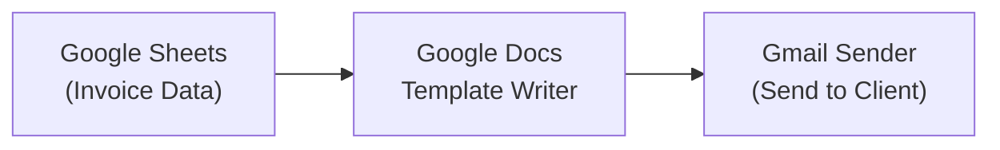
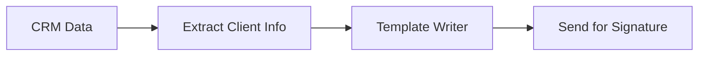
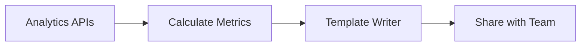
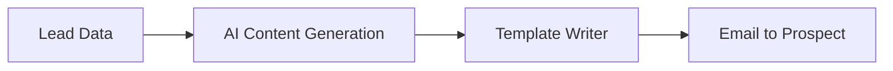

> ## Documentation Index
> Fetch the complete documentation index at: https://docs.gumloop.com/llms.txt
> Use this file to discover all available pages before exploring further.

# Google Docs Template Writer

This document explains the Google Docs Template Writer node, which automates document creation by using templates with placeholder variables.

## How It Works

Imagine you have a Google Doc template for contracts, invoices, or reports. Instead of manually copying and editing this template each time, you can add placeholder variables wherever content needs to change. The Google Docs Template Writer node automatically detects these placeholders and replaces them with your data.

Here's the process:

1. **Create a template** in Google Docs with placeholder variables
2. **Add the node** to your Gumloop workflow
3. **Enter the template link** - the node automatically detects all placeholders
4. **Connect data** from other nodes to fill in the placeholders
5. **Run the workflow** - a new document is created with your data

> **Note**: The node creates a new document each time it runs. Your original template remains unchanged.

## Understanding Placeholders

### Creating Placeholders in Your Template

To mark content as replaceable, wrap it in double curly braces: `{{placeholder_name}}`

For example, in your Google Doc template:

* Instead of writing "John Smith", write `{{client_name}}`
* Instead of writing "January 15, 2025", write `{{contract_date}}`
* Instead of writing "\$5,000", write `{{total_amount}}`

### How Placeholders Become Node Inputs

When you enter your Google Doc template link in the node:

1. The node scans your entire template
2. It finds all placeholders (anything inside `{{ }}`)
3. Each placeholder automatically appears as an input field in the node
4. You can then connect outputs from other nodes (like Google Sheets data, AI-generated content, or calculated values) to these inputs

This means you don't need to manually configure what to replace - the node handles it automatically based on your template design.

### Placeholder Naming Rules

**Valid formats:**

* Letters and numbers: `{{invoice123}}`
* Underscores: `{{first_name}}`
* Spaces: `{{Company Name}}`
* Dots: `{{client.address}}`
* Hyphens: `{{q1-revenue}}`

**Invalid characters:**

* Forward slashes: `{{path/to/file}}` ❌
* Square brackets: `{{array[0]}}` ❌
* Colons: `{{time:date}}` ❌

## Basic Configuration

The node has minimal required configuration:

**Required:**

* **Template Link**: URL to your Google Docs template

**Optional:**

* **New Document Name**: Custom name for the generated document (auto-generated if blank)
* **Folder**: Where to save the new document
* **Make Doc Public**: Share the document publicly
* **Error On Missing Placeholder**: Whether to fail if a placeholder has no value

**Output:**

* **Document Link**: URL to your newly created document
* **Document ID**: Unique identifier for the document

## Example: Creating an Invoice

Let's walk through a practical example of automating invoice creation.

### Step 1: Create Your Template

In Google Docs, create an invoice template with these placeholder variables:

**Invoice Header:**

* `INVOICE #` followed by `{{invoice_number}}`
* `Date:` followed by `{{invoice_date}}`

**Billing Information:**

* `Bill To:` section with `{{client_name}}` and `{{client_address}}`

**Service Details:**

* `Services:` followed by `{{service_description}}`

**Payment Information:**

* `Total:` followed by `{{total_amount}}`
* `Due Date:` followed by `{{due_date}}`

### Step 2: Build Your Workflow

### Step 3: Configure the Node

1. **Enter template link** - The node detects 7 placeholders
2. **Connect your data sources:**

   * `invoice_number` ← Sheet column A
   * `invoice_date` ← Datetime node
   * `client_name` ← Sheet column B
   * `client_address` ← Sheet column C
   * `service_description` ← Sheet column D
   * `total_amount` ← Sheet column E
   * `due_date` ← Calculated date
3. **Set document name** to `"Invoice-{{invoice_number}}"`
4. **Run the workflow**

### Result

A new Google Doc is created with all placeholders replaced with actual data, ready to send to your client.

## Common Use Cases

### Automated Contracts

### Performance Reports

### Personalized Proposals

## Processing Multiple Documents

To create multiple documents from a list of data:

1. **Enable Loop Mode** on the Google Docs Template Writer node
2. **Connect list inputs** - Each placeholder receives a list of values
3. **Run once** - Creates multiple documents automatically

Example: Creating 50 personalized contracts from a spreadsheet with 50 rows of client data.

## Best Practices

### 1. Template Design

Start with a well-structured template:

* Use descriptive placeholder names (`{{client_full_name}}` not `{{name}}`)
* Place placeholders strategically where content varies
* Test with sample data

### 2. Data Preparation

Ensure your data is ready:

* Format dates and numbers consistently
* Clean text data (remove extra spaces, fix capitalization)
* Validate required fields before processing

## Important Considerations

<Warning>
  Placeholders are **case-sensitive**. The placeholder `{{Company}}` is different from `{{company}}`. Ensure exact matches between your template and data sources.
</Warning>

<Note>
  You must authenticate with Google to use this node. Connect your Google account in the [Connectors page](https://www.gumloop.com/personal/connectors).
</Note>

## Troubleshooting Guide

| Issue                       | Cause                    | Solution                                                                   |
| --------------------------- | ------------------------ | -------------------------------------------------------------------------- |
| "Google Doc not found"      | Invalid URL or no access | Check URL and ensure the template is shared with your Google account       |
| "No placeholders detected"  | Wrong format             | Verify placeholders use `{{name}}` format                                  |
| "Missing placeholder value" | No data connected        | Connect data to all placeholders or disable "Error On Missing Placeholder" |
| "Cannot create document"    | Permission issue         | Check Google Drive permissions and available storage                       |

## Comparison: Template Writer vs Google Docs Writer

| Use Case                | Template Writer                     | Google Docs Writer            |
| ----------------------- | ----------------------------------- | ----------------------------- |
| **Starting Point**      | Existing template with placeholders | Blank or existing document    |
| **Content Replacement** | Automatic placeholder detection     | Manual content insertion      |
| **Best For**            | Structured, repeatable documents    | Free-form writing and updates |
| **Examples**            | Contracts, invoices, certificates   | Meeting notes, documentation  |

The Google Docs Template Writer node transforms static templates into dynamic, automated document generation systems. By understanding how placeholders work and connecting them to your data sources, you can eliminate hours of manual document creation.
