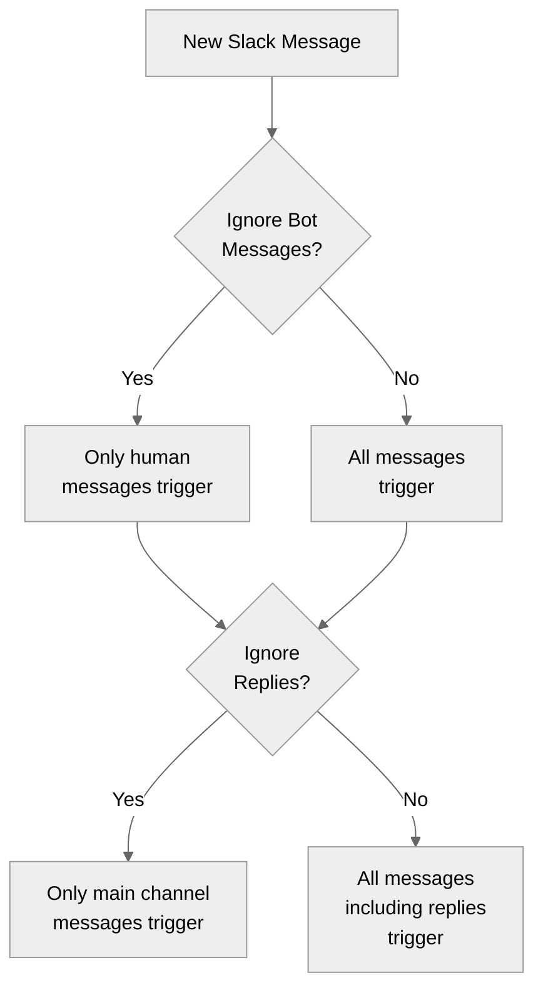

> ## Documentation Index
> Fetch the complete documentation index at: https://docs.gumloop.com/llms.txt
> Use this file to discover all available pages before exploring further.

# Slack Message Reader

The **Slack Message Reader** node retrieves messages, threads, sender details, and attachments from Slack channels. It supports triggers for automation and can be customized to filter and fetch specific data for your workflows.

## Channel Access Requirements

<Info>
  To read messages from any Slack channel (public or private), you must be a member of that channel. Channels you're not a member of won't appear in the dropdown.
</Info>

<Steps>
  <Step title="Authenticate with Slack">
    Go to the [Connectors page](https://www.gumloop.com/personal/connectors) and connect your Slack workspace.
  </Step>

  <Step title="Join the Channel">
    Make sure you're a member of the channel you want to read from. Private channels require an invite from an existing member.
  </Step>

  <Step title="Select the Channel">
    The channel will now appear in the dropdown menu in the node configuration.
  </Step>
</Steps>

## Node Configuration

### Message Information Options

Select which data elements you want to retrieve from Slack messages:

| Output               | Description                                                                                                                                     |
| -------------------- | ----------------------------------------------------------------------------------------------------------------------------------------------- |
| **Messages**         | The actual text content of messages, including formatted text, emojis, and timestamps. If "Read Full Thread" is enabled, this includes replies. |
| **Thread IDs**       | Unique identifiers for each message thread. Useful for replying to specific threads using the Slack Message Sender node.                        |
| **Thread Links**     | Direct URLs to specific message threads in Slack for quick access to original discussions.                                                      |
| **Attachment Names** | Files shared in messages including documents, images, and videos.                                                                               |
| **Sender Names**     | Names of users who sent the messages. Useful for filtering or routing based on sender.                                                          |
| **Channel Name**     | The name of the channel where messages were posted.                                                                                             |
| **Channel ID**       | The unique identifier for the Slack channel, useful for API integrations.                                                                       |
| **Date**             | The datetime in UTC when the message was sent.                                                                                                  |

### Basic Settings

1. **Channel**: Select target Slack channel
2. **Message Count**: Number of messages to fetch (default: 10)
   * Set to 1 for single message processing
     * The output in this case is in the `Text` format
   * Higher numbers return lists of messages
     * The output in this case is in the `List` format

### Optional Settings

<AccordionGroup>
  <Accordion title="Date Range Filtering">
    Filter messages by a specific time period:

    * **Use Dates?**: Enable to filter messages by time period
    * **Date Range**: Choose from preset ranges (Last 24 Hours, Last Week, Last Month, Last 3 Months, Last 6 Months)
    * **Use Exact Dates?**: Toggle to specify custom date ranges with precise Start and End dates

    <Tip>
      When "Use Exact Dates?" is enabled, connect the Start Date and End Date inputs to a `Datetime` node for dynamic date ranges.
    </Tip>
  </Accordion>

  <Accordion title="Thread Settings">
    * **Read Full Thread**: When enabled, retrieves the main message plus all replies in the thread, including participant information. Perfect for tracking complete conversations or support threads.
  </Accordion>

  <Accordion title="Bot Message Handling">
    * **Ignore Bot Messages**: When enabled, skips messages from all Slack apps and integrations, processing only messages from human users. Useful when multiple automations are active in the channel.
  </Accordion>
</AccordionGroup>

### Configure Inputs

Make these parameters dynamic by enabling them in "Configure Inputs":

* **Channel**: Switch channels based on conditions or other node outputs
* **Message Count**: Adjust the volume of messages processed based on workflow needs
* **Start Date**: Dynamically adjust your date window (requires "Use Dates?" enabled)
* **End Date**: Pair with Start Date for dynamic date ranges

## Trigger Mode

The Slack Message Reader can function as a trigger to start your workflow when new messages arrive.

<div align="center">
  
</div>

### Trigger Settings

<AccordionGroup>
  <Accordion title="Ignore Bot Messages?">
    * **No (Default)**: All messages trigger your workflow, including those from bots and integrations
    * **Yes (Recommended)**: Only human-generated messages trigger your workflow
      * Prevents trigger loops where your workflow output triggers itself
      * Reduces noise from system notifications
      * Essential when your workflow posts back to the same channel
  </Accordion>

  <Accordion title="Ignore Replies?">
    * **No (Default)**: All messages trigger your workflow, including replies in threads
      * Best for monitoring ongoing conversations
      * Useful for support bots tracking entire discussions
    * **Yes**: Only new standalone messages trigger your workflow
      * Replies within conversation threads are ignored
      * Focuses automation on new topics only
  </Accordion>
</AccordionGroup>

<Warning>
  When building response bots, always enable "Ignore Bot Messages" to prevent infinite loops where your bot responds to its own messages.
</Warning>

### Recommended Trigger Settings

For most automations:

* **Ignore Bot Messages: Yes** - Prevents trigger loops and focuses on human communications
* **Ignore Replies: No** - Captures all relevant communications including thread discussions



> **Note**: When building response bots, always enable "Ignore Bot Messages" to prevent infinite loops where your bot responds to its own messages.

## Example Workflows

### Customer Support Monitor

```text theme={"dark"}
Slack Message Reader -> Ask AI -> Notion Page Writer
```

* **Channel**: #support
* **Read Full Thread**: Yes
* **Ignore Bot Messages**: No
* **Purpose**: Analyze and document support conversations

### Team Updates Trigger

```text theme={"dark"}
Slack Message Reader [Trigger] -> Categorizer -> Gmail Sender
```

* **Channel**: #team-updates
* **Message Count**: 1
* **Ignore Bot Messages**: Yes
* **Purpose**: Send important updates to stakeholders

### Resource Archival

```text theme={"dark"}
Slack Message Reader -> Attachments Output -> Google Drive File Writer
```

* **Channel**: #resources
* **Read Full Thread**: Yes
* **Date Range**: Last 7 days
* **Purpose**: Archive shared resources and documentation

### Weekly Channel Report

```text theme={"dark"}
Current DateTime -> Slack Message Reader -> Ask AI -> Gmail Sender
```

* **Use Dates?**: Yes
* **Use Exact Dates?**: Yes
* **Start Date**: Connected to Current DateTime with -7 days modifier
* **End Date**: Connected to Current DateTime
* **Purpose**: Generate weekly summary reports of channel activity

## Output Format

The output format changes based on Message Count:

### Multiple Messages (Count > 1)

Returns lists:

* Messages: \["Hello", "How are you"]
* Thread IDs: \["123", "456"]
* Thread Links: \["[https://company.slack.com/archives/C123/p456](https://company.slack.com/archives/C123/p456)", "[https://company.slack.com/archives/C123/p789](https://company.slack.com/archives/C123/p789)"]
* Sender Names: \["Alice", "Bob"]
* Channel Name: \["general", "general"]
* Channel ID: \["C123456", "C123456"]

### Single Message (Count = 1)

Returns single values \[text]:

* Message: "Hello"
* Thread ID: "123"
* Thread Link: "[https://company.slack.com/archives/C123/p456](https://company.slack.com/archives/C123/p456)"
* Sender Name: "Alice"
* Channel Name: "general"
* Channel ID: "C123456"

## Important Considerations

1. **Authentication**: Set up Slack authentication in the [Connectors page](https://www.gumloop.com/personal/connectors)
2. **Channel Membership**: You must be a member of the channel for it to appear in the dropdown
3. **Thread Messages**: Thread messages will trigger workflows when using as trigger
4. **Bot Filtering**: Bot message filtering applies to thread replies as well
5. **Timezone**: Date filtering uses UTC timezone, which may not match your local time

## Advanced Slack Features

<Info>
  Need more advanced Slack capabilities like managing channels, uploading files, or adding reactions? Use the [Slack MCP node](/nodes/mcp/slack) to create custom Slack integrations with natural language prompts.
</Info>
