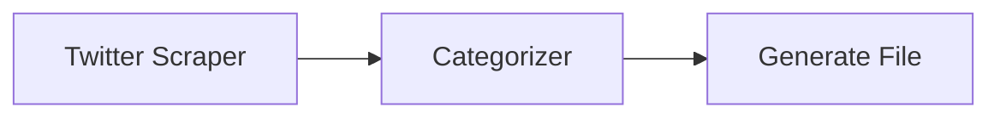
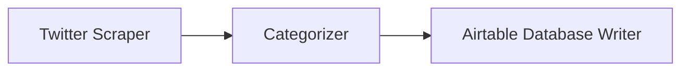
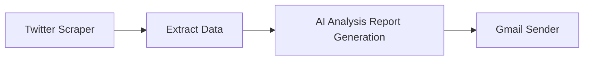

> ## Documentation Index
> Fetch the complete documentation index at: https://docs.gumloop.com/llms.txt
> Use this file to discover all available pages before exploring further.

# Twitter Scraper

## Overview

The Twitter Scraper node enables automated collection of Twitter/X posts, user information, and engagement metrics through the Twitter API. This node is perfect for social media monitoring, sentiment analysis, and user research.

> **Important**: A Twitter Developer Account is required to use this node.

## Core Features

* Scrape tweets by username or search term
* Collect user metrics and engagement data
* Support for multiple post types
* Customizable data outputs
* Batch processing capability

## Configuration

### Input Parameters

#### 1. Query (Required)

* Format: Text string
* Examples:
  * Username: `@username`
  * Search terms: `artificial intelligence`
  * Hashtags: `#AI`

#### 2. Post Limit (Optional)

* Default: 100 posts
* Range: 1-100
* Format: Integer
* Controls the maximum number of posts retrieved

#### 3. Post Types (Multiple Selection)

* **Posts**: Original tweets
* **Replies**: Response tweets
* **Retweets**: Shared tweets
* Note: Select multiple types to include various content

#### 4. Outputs (Multiple Selection)

Available data points to extract:

* **Post Content**: The tweet text
* **Post Author**: Username of the tweet creator
* **Follower Count**: Number of followers for the author
* **Post URL**: Direct link to the tweet

### Output Format

All selected outputs are returned as lists (array)

## Usage Examples

### 1. Basic User Analysis

**Setup**:

* Query: `@username`
* Post Types: Posts only
* Outputs: Post Content, Follower Count

### 2. Hashtag Monitoring

**Setup**:

* Query: `#hashtag`
* Post Types: Posts, Retweets
* Outputs: All fields

### 3. Competitor Analysis

**Setup**:

* Query: Multiple competitor handles
* Post Types: All
* Outputs: All fields
* Loop Mode: Enabled

## Best Practices

### Optimization Tips

1. **Query Structure**
   * Use precise usernames/terms
   * Include relevant hashtags
   * Avoid overly broad searches

2. **Rate Limiting**
   * Monitor API usage
   * Use appropriate post limits

### Common Workflows

1. **Social Media Monitoring**
   * Twitter Scraper → Sentiment Analysis → Alert System
   * Monitor brand mentions and sentiment

2. **Content Curation**
   * Twitter Scraper → Categorizer → Content Generator
   * Create digests of industry news

3. **Market Research**
   * Twitter Scraper → Data Extraction → Analytics
   * Analyze trends and competitors

## Technical Notes

### Prerequisites

1. [Twitter Developer Account](https://developer.twitter.com/)
2. [API credentials configured in Gumloop](https://www.gumloop.com/personal/connectors)

### Limitations

* Maximum 100 posts per query
* API rate limits apply
* Some content may be unavailable

## Troubleshooting

### Common Issues

1. **Authentication Errors**
   * Verify API credentials
   * Check account status
   * Confirm rate limits

2. **Empty Results**
   * Validate query syntax
   * Check content availability
   * Verify account permissions

## In Summary

The Twitter Scraper node enables automated collection of Twitter/X posts, user data, and engagement metrics using the Twitter API. It supports queries by username, search terms, and hashtags, offering customizable outputs for social media monitoring, sentiment analysis, and market research.
