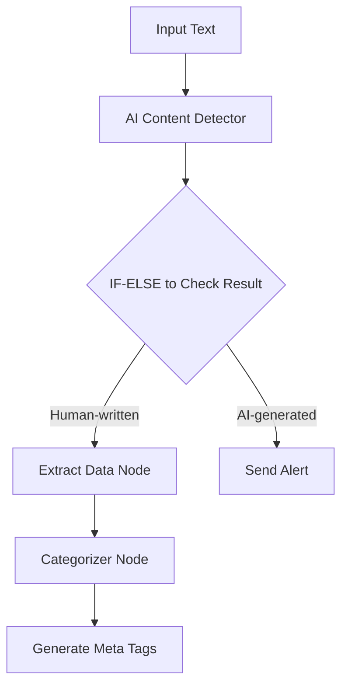
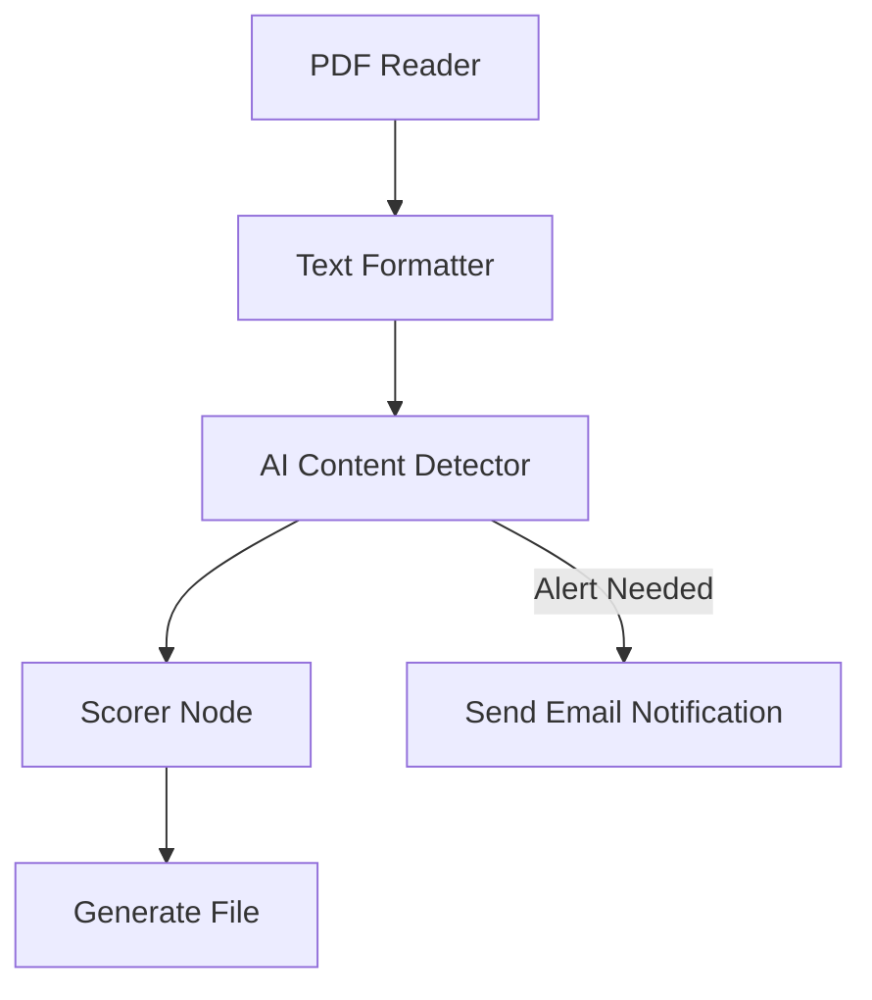
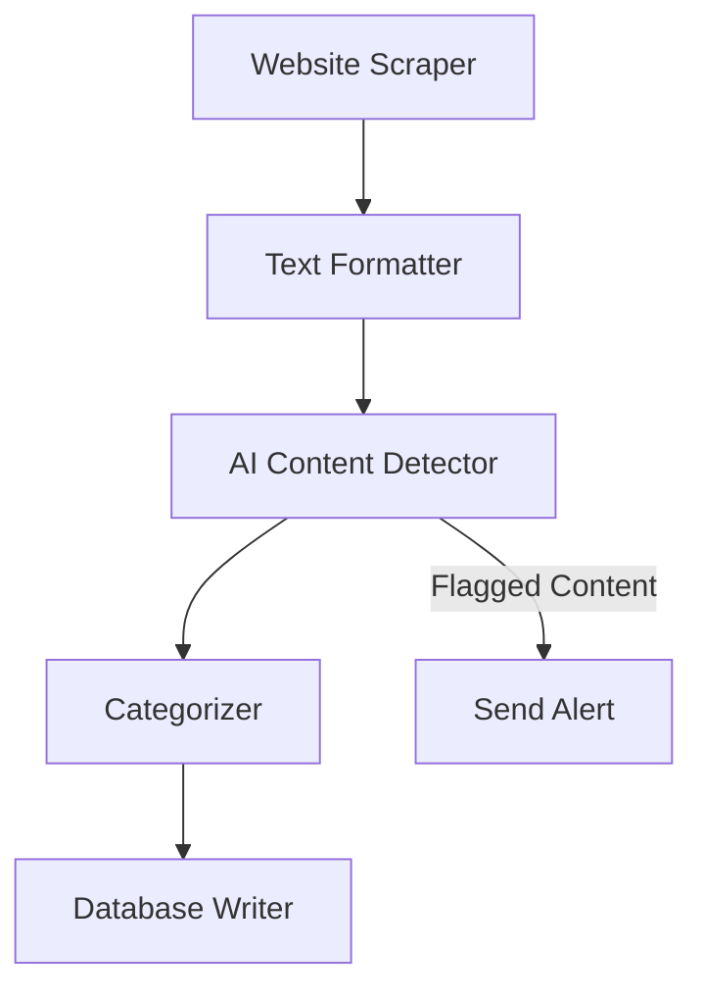

> ## Documentation Index
> Fetch the complete documentation index at: https://docs.gumloop.com/llms.txt
> Use this file to discover all available pages before exploring further.

# AI Content Detector

## Overview

The AI Content Detector is a powerful node that analyzes text to determine whether it was written by a human or generated by AI. Using GPTZero's advanced detection model, it provides reliable analysis with detailed insights and confidence scores.

## Quick Start

* **Input**: Text content to analyze (single piece or batch)
* **Cost**: 30 credits per 1,000 words
* **Output**: AI detection verdict, confidence score, detailed analysis
* **Main use**: Content verification, authenticity checks, plagiarism detection

## Core Features

1. **Accurate Detection**
   * Analyzes writing patterns and text structure
   * Provides confidence scores for reliability
   * Identifies mixed content (partially AI-generated)

2. **Detailed Analysis**
   * Writing style metrics
   * Sentence structure analysis
   * Word choice patterns
   * Readability scores

3. **Batch Processing**
   * Analyze multiple texts simultaneously
   * Efficient processing in Loop Mode
   * Consistent results across large datasets

## Input and Output Specifications

### Input Fields

* **Content**: Text to analyze (required)
  * Type: Text or List (in Loop Mode)
  * Format: Plain text

### Output Fields

1. **AI Detection Result**
   * Type: Text (String)
   * Possible values: "Human-written", "AI-generated", "Mixed"

2. **Confidence Level**
   * Range: 0-100%
   * Format: Decimal percentage

3. **Detailed Message**
   * Type: Text (String)
   * Includes: Reasoning for the result and key findings

4. **Writing Statistics**
   * Type: JSON Object
   * Contains: Readability metrics, sentence analysis, pattern detection

## Practical Workflow Examples

### 1. Content Marketing Validation Pipeline

**Goal**: Validate blog posts and generate SEO metadata for approved content

**Nodes Used**:

1. AI Content Detector
   * Analyzes submitted content
   * Confidence threshold: 80%

2. Extract Data Node
   * Pulls key topics and themes
   * Identifies main keywords

3. Categorizer Node
   * Assigns content categories
   * Tags content type

4. Ask AI Node
   * Generates SEO meta descriptions
   * Creates social media snippets

### 2. Academic Submission Review System

**Goal**: Screen student assignments for AI-generated content and provide detailed feedback

**Workflow Steps**:

1. PDF Reader Node
   * Extracts text from submissions
   * Maintains formatting

2. Text Formatter Node
   * Normalizes text structure

3. AI Content Detector
   * Analyzes content authenticity
   * Generates detailed reports

4. Scorer Node
   * Evaluates writing quality based on set rubric
   * Provides feedback points (enable AI Justification output)

5. Send Email Notification Node
   * Alerts instructors of potential issues
   * Sends automated feedback

### 3. Content Moderation System

**Goal**: Review and categorize user-submitted content across multiple platforms

**Integration Points**:

1. Website Scraper Node
   * Extracts relevant text from article or blog

2. AI Content Detector
   * Screens for AI-generated content
   * Provides confidence scores

3. Categorizer Node
   * Classifies content type
   * Tags content themes

4. Airtable Database Writer Node
   * Stores analysis results
   * Updates content status

## Best Practices

### Optimization Tips

1. **Batch Processing**
   * Use Loop Mode for multiple content items

2. **Credit Management**
   * Estimate word count beforehand
   * Use Text Formatter, Find & Replace, or Chunk Text to clean input
   * Remove unnecessary content

## Limitations and Considerations

* Possible false positives
* Language support restrictions

## Additional Resources

* [GPTZero Documentation](https://gptzero.me/)
* Related nodes: [Categorizer](https://docs.gumloop.com/nodes/using_ai/categorizer), [Ask AI](https://docs.gumloop.com/nodes/using_ai/ask_ai), [Text Formatter](https://docs.gumloop.com/nodes/text_manipulation/text_formatter)
