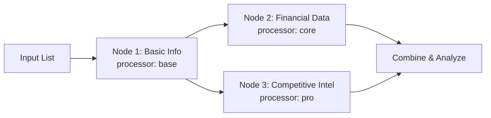

> ## Documentation Index
> Fetch the complete documentation index at: https://docs.gumloop.com/llms.txt
> Use this file to discover all available pages before exploring further.

# AI Web Research

This document explains the AI Web Research node, which combines web search and structured data extraction capabilities into one powerful automation node. Built on advanced AI models, this node enables automated web research, data analysis, and information synthesis from multiple sources.

## Getting Started

### Quick Setup Video

<video width="800" controls>
  <source src="https://storage.googleapis.com/agenthub-public/docs/web_research_demo.mp4" type="video/mp4" />
</video>

### Step-by-Step Guide

<Steps>
  <Step title="Add your research prompt">
    Write a clear prompt describing what you want to research

    * Use the format: "Given \[input], find/analyze/research \[output]"
    * Example: `"Given a company name, find their latest funding and news"`
  </Step>

  <Step title="Generate Inputs and Outputs">
    Click the button to create your schema

    * The AI analyzes your prompt and generates appropriate fields
    * Review the generated inputs and outputs
  </Step>

  <Step title="Connect inputs">
    Link data from previous nodes

    * The node shows expected input types (List or single value)
    * Match your data sources to the generated inputs
  </Step>

  <Step title="Select Research Type">
    Choose your processor

    * Use Auto-Select for intelligent optimization
    * Or manually select based on your needs
  </Step>

  <Step title="Run and review">
    Execute the research and check outputs

    * Citations and reasoning are always included
    * Connect outputs to downstream nodes
  </Step>
</Steps>

## Schema Generation

### Initial Generation

When you click **"Generate Inputs and Outputs"**, the system creates a custom schema based on your research prompt.


### Schema Refinement

After generating your initial schema, you can refine it if needed by clicking **"Regenerate Inputs and Outputs"** again. This opens a dialog with two options:


<Tabs>
  <Tab title="Refine Current Schema">
    **When to use:** You want to adjust the existing fields without starting over

    **How it works:**

    * Provide feedback on what to change
    * The AI modifies your current schema based on feedback
    * Preserves the overall structure while making adjustments

    **Example refinements:**

    * "Add funding information and remove the website field"
    * "Include employee count and industry classification"
    * "Change company description to be more detailed"
  </Tab>

  <Tab title="Generate New Schema">
    **When to use:** You want to completely change your research approach

    **How it works:**

    * Creates a fresh schema from scratch
    * Based on your updated research prompt
    * Discards the previous schema entirely

    **Example scenarios:**

    * Switching from company research to people research
    * Changing from financial analysis to competitive analysis
    * Moving from basic enrichment to deep investigation
  </Tab>
</Tabs>

## Research Type Processors

<Info>
  **Pro tip:** Start with Auto-Select mode - it intelligently chooses between lite, base, and core processors to optimize for both cost and performance.
</Info>

### Processor Comparison

| Processor | Credits | Time    | Max Fields | Best Use Cases                      |
| --------- | ------- | ------- | ---------- | ----------------------------------- |
| **lite**  | 4       | 5-60s   | \~2        | Quick lookups, simple facts         |
| **base**  | 8       | 15-100s | \~5        | Standard enrichment, basic research |
| **core**  | 20      | 1-5m    | \~10       | Business research, cross-validation |
| **pro**   | 80      | 3-9m    | \~20       | Exploratory research, deep analysis |
| **ultra** | 200     | 5-25m   | \~20       | Comprehensive reports, PDF analysis |

### Processor Selection Guide

<AccordionGroup>
  <Accordion title="Lite Processor (4 credits)" icon="bolt">
    **Perfect for simple, fast lookups**

    **Use cases:**

    * Company addresses and phone numbers
    * Website URLs and social media handles
    * Basic business information (founded date, CEO name)
    * Simple yes/no verifications

    **Real examples:**

    ```text theme={"dark"}
    "Given a company name, find their headquarters address"
    "Given a website, extract the contact email"
    "Given a business name, find if they have a mobile app"
    ```
  </Accordion>

  <Accordion title="Base Processor (8 credits)" icon="layer-group">
    **Ideal for standard enrichment tasks**

    **Use cases:**

    * Product offerings and service descriptions
    * Team size and office locations
    * Industry classification and business model
    * Recent announcements or updates

    **Real examples:**

    ```text theme={"dark"}
    "Given a company website, extract their main products and pricing tiers"
    "Given a startup name, find their target market and value proposition"
    "Given a business domain, identify their key partnerships"
    ```
  </Accordion>

  <Accordion title="Core Processor (20 credits)" icon="star">
    **Recommended for most business research**

    **Use cases:**

    * Competitive positioning and market analysis
    * Financial metrics and growth indicators
    * Leadership team and board composition
    * Technology stack and integrations

    **Real examples:**

    ```text theme={"dark"}
    "Given a company, research their funding history, investors, and valuation"
    "Given a competitor list, analyze their pricing strategies and differentiators"
    "Given an industry, identify top players and market dynamics"
    ```

    <Note>
      Core processor includes confidence scores and detailed citations for each field.
    </Note>
  </Accordion>

  <Accordion title="Pro Processor (80 credits)" icon="rocket">
    **For complex, exploratory research**

    **Use cases:**

    * Multi-dimensional company analysis
    * Deep competitive intelligence
    * Comprehensive market research
    * Investment due diligence

    **Real examples:**

    ```text theme={"dark"}
    "Given a company, analyze their business model, revenue streams, competitive advantages, risks, and growth potential"
    "Given a market segment, research all major players, their strategies, partnerships, and recent developments"
    "Given an acquisition target, evaluate their technology, team, financials, and strategic fit"
    ```
  </Accordion>

  <Accordion title="Ultra Processor (200 credits)" icon="crown">
    **Maximum depth for critical research**

    **Use cases:**

    * Analyzing lengthy PDFs and reports on the web
    * Comprehensive regulatory compliance research
    * Deep technical documentation analysis
    * Multi-source investigative research

    **Real examples:**

    ```text theme={"dark"}
    "Given a company's SEC filings URL, extract all financial metrics, risks, and strategic initiatives"
    "Given a technology, research all implementations, case studies, benchmarks, and limitations"
    "Given an industry regulation, analyze compliance requirements, penalties, and implementation guidelines"
    ```
  </Accordion>
</AccordionGroup>

## Output Structure

### Standard Outputs

All research tasks include these base outputs:

<CardGroup cols={2}>
  <Card title="Citations" icon="link">
    Source URLs and references for all findings
  </Card>

  <Card title="Reasoning" icon="brain">
    Detailed explanation of research methodology
  </Card>
</CardGroup>

<Note>
  The language of the Reasoning output is automatically inferred from your research prompt and input data. If your prompt is written in French, the reasoning will be returned in French. To ensure consistent language across runs, write your research prompt in your preferred language.
</Note>

### Enhanced Outputs (Core/Pro/Ultra)

Advanced processors provide additional metadata for each field:

<CardGroup cols={2}>
  <Card title="Field-Specific Reasoning" icon="message">
    `[field_name]_reasoning` - How each value was determined
  </Card>

  <Card title="Field Citations" icon="bookmark">
    `[field_name]_citations` - Sources for specific data points
  </Card>

  <Card title="Confidence Scores" icon="chart-simple">
    `[field_name]_confidence` - Reliability rating (High, Medium, or Low)
  </Card>
</CardGroup>

## Practical Examples

### Sales Intelligence Workflow

<CodeGroup>
  ```yaml Company Enrichment theme={"dark"}
  Research Prompt: "Given a company domain, find decision makers, 
                   recent news, and technology stack"
  Processor: core
  Inputs: company_domain
  Outputs: 
    - executives (with LinkedIn URLs)
    - recent_developments
    - tech_stack
    - company_size
    - funding_status
  ```

  ```yaml Lead Scoring theme={"dark"}
  Research Prompt: "Given a prospect company, evaluate their fit 
                   based on size, technology, and growth signals"
  Processor: base
  Inputs: company_name
  Outputs:
    - employee_count
    - uses_target_technology
    - recent_hiring
    - expansion_indicators
  ```
</CodeGroup>

### Investment Research Pipeline

<CodeGroup>
  ```yaml Due Diligence theme={"dark"}
  Research Prompt: "Given a startup, analyze their market position, 
                   team, traction, and competitive landscape"
  Processor: pro
  Inputs: startup_name, website
  Outputs:
    - founding_team_background
    - market_size
    - key_competitors
    - unique_advantages
    - customer_traction
    - risk_factors
  ```

  ```yaml Market Analysis theme={"dark"}
  Research Prompt: "Given an industry vertical, map the ecosystem 
                   including players, trends, and opportunities"
  Processor: ultra
  Inputs: industry_name
  Outputs:
    - market_leaders
    - emerging_players
    - technology_trends
    - regulatory_landscape
    - investment_activity
    - growth_projections
  ```
</CodeGroup>

## Best Practices

### Writing Effective Prompts

<Tabs>
  <Tab title="Do's ✅">
    * Be specific about what information you need
    * Use clear input/output structure
    * Specify the context or use case
    * Include any special requirements

    **Good examples:**

    * "Given a SaaS company website, extract pricing tiers, features, and integration partners"
    * "Given a company name and industry, find their main competitors and market share"
  </Tab>

  <Tab title="Don'ts ❌">
    * Avoid vague or open-ended requests
    * Don't ask for subjective opinions
    * Avoid requesting too many fields at once

    **Poor examples:**

    * "Tell me everything about this company"
    * "Is this a good investment?"
    * "Find all possible information"
  </Tab>
</Tabs>

### Optimization Strategies

<Steps>
  <Step title="Start with Auto-Select">
    Let the system optimize processor selection for you
  </Step>

  <Step title="Test with small batches">
    Validate your schema with 2-3 examples before scaling
  </Step>

  <Step title="Monitor credit usage">
    Track consumption and adjust processors as needed
  </Step>

  <Step title="Chain nodes strategically">
    Split complex research into multiple focused nodes
  </Step>
</Steps>

### Advanced Techniques

#### Research Chaining

For comprehensive analysis, chain multiple nodes:



## Troubleshooting

<Warning>
  The Ultra processor can take up to 25 minutes. Consider using lower processors if speed is critical.
</Warning>

<AccordionGroup>
  <Accordion title="No outputs generated">
    * Verify your research prompt is clear and specific
    * Click "Regenerate Inputs and Outputs" to update schema
    * Ensure all required inputs are connected
    * Check that input data is in the correct format
  </Accordion>

  <Accordion title="Inconsistent results">
    * Add more specific requirements to your prompt
    * Upgrade to core or higher processors
    * Review citations to understand data sources
    * Use confidence scores to filter results
  </Accordion>
</AccordionGroup>

The AI Web Research node represents the most advanced research capability on the Gumloop platform, combining automated web research with precise data extraction to deliver comprehensive, accurate results tailored to your business automation needs.
